# Modeling Handoff

## Run metadata

- Run ID: `c6dc290a4a1b`
- Started: 2026-08-26T22:28:39.084655+00:00
- Completed: 2026-08-26T22:57:00.896276+00:00
- Git commit: `6799fd3a15e1e0eb7df0e84ab6ee4a7f7f71e0c9`
- Git dirty: True
- Workflow status: completed
- Seeds: workflow=42, sfs=42, ga=42, hpo=42, model=42, clustering=60
- Package versions:
  - python: `3.12.2`
  - qsar_agent: `1.0.0`
  - scikit-learn: `1.9.0`
  - pandas: `3.0.5`
  - numpy: `1.26.4`
  - rdkit: `2026.3.4`
  - umap-learn: `0.5.12`
  - deap: `1.4.4`
  - mlxtend: `0.23.4`
  - joblib: `1.5.3`
  - streamlit: `1.60.0`
  - mordred: `1.2.0`

### Workflow stages

- `dataset_validation`: Completed
- `descriptor_calculation`: Completed — backends=RDKit; 3D_descriptors=False
- `umap_split`: Completed — method=sorted
- `descriptor_preprocessing`: Completed
- `sequential_feature_selection`: Completed
- `feature_count_selection`: Completed
- `genetic_algorithm`: Completed
- `baseline_cv_diagnostics`: Completed
- `overfitting_assessment`: Completed
- `hpo_round_1`: Completed — Best CV R²=0.534
- `hpo_round_2`: Completed — Best CV R²=0.534
- `hpo_round_3`: Completed — Best CV R²=0.537
- `final_model_selection`: Completed
- `model_fallback`: Completed — Tried 4 fallback model(s); winner: SVR (sfs_fixed_ga_plus2)
- `final_model`: Completed
- `applicability_domain`: Completed

## Problem definition

- Task: regression
- Target: `target`
- Target transformation: `identity`
- Units: unspecified
- Primary metric: `r2`
- Acceptance criteria:
  - minimum CV r2: 0.500000
  - overfit gap threshold: 0.150000
  - severe overfit gap threshold: 0.250000
  - CV std threshold: 0.150000
  - minimum train r2: 0.400000
  - min CV improvement: 0.020000

## Dataset audit

- **input** compounds=191
- **after_structure_and_activity_validation** compounds=191 removed=0
- **after_descriptor_calculation** compounds=191 features=220
- **after_nonnumeric_filter** features=220 removed=0
- **after_missing_filter** features=220 removed=0
- **after_constant_filter** features=176 removed=44
- **after_near_constant_filter** features=176 removed=0
- **after_correlation_filter** features=139 removed=37
- **after_split** compounds=191 train=153, val=19, test=19

- Invalid structures: 0
- Duplicates: 0
- Missing or invalid activity: 0
- Descriptors with missing values: 0
- Train / validation / test sizes: 153 / 19 / 19
- Split strategy: `sorted`
- Dataset hash: `8b547ba5d2a0032165ca1bfc37aad3924cde60de3ef2a0014f33a8566e8041d4`
- Target statistics:
  - min: 1.077000
  - max: 5.310000
  - mean: 2.654225
  - median: 2.430000
  - std: 0.977187
- Feature counts:
  - raw_descriptors: 220
  - generated_descriptors: 220
  - external_descriptors: 0
  - after_preprocessing: 139
  - one_se_selected_feature_count: 6
  - ga_selected_feature_count: 6
- Duplicate overlap train-val: none
- Duplicate overlap train-test: none
- Duplicate overlap val-test: none

## Leakage safeguards

- Test-lock status: `locked_from_selection`
- Test compound-ID hash: `5598edd2f4bc942297800f3f92b170a7585719b30bf50943000255545a1b6789`
- Preprocessing scope: train_only_fit
- Feature-selection scope: train_cv_and_holdout_validation
- Duplicate overlap present: False
- Test results used for model selection: False
- Selection criterion: Highest combined R² (equal-weight mean training CV R² and holdout validation R²) among acceptable models, with a one-standard-error rule and estimator-simplicity tie-break. External-test metrics were not used for model selection.
- Confirmation: Model selection used training cross-validation and held-out validation only. External-test predictions were generated after selection and did not influence the winning run.

## Representation and preprocessing

- Descriptor backends: RDKit
- Fingerprints enabled: False
- Fingerprint types: []
- Fingerprint note: Hashed fingerprints were not used; representation is 2D molecular descriptors.
- Geometry optimization: False
- 3D descriptors included: False
- Scaling: `StandardScaler`
- Imputation: `median`
- Preprocessor: `models/descriptor_preprocessor.joblib`
- Filters:
  - missing_value_threshold: 0.2
  - near_constant_std_threshold: 0.01
  - correlation_threshold: 0.95
- Pipeline order:
  1. `drop_nonnumeric_descriptors`
  2. `drop_high_missing_fraction`
  3. `median_imputation`
  4. `drop_constant_descriptors`
  5. `drop_near_constant_descriptors`
  6. `drop_highly_correlated_descriptors`
  7. `standard_scaler`

## Validation design

- CV method: `KFold`
- Folds: 5
- Repeats: 1
- Shuffle: True
- Seed: 42
- Tuning method: `GridSearchCV`
- Search budget (max candidates per round): 120
- Optimization metric: `r2`
- Combined score: 0.5·mean training CV R² + 0.5·holdout validation R²

## Experiment ledger

| run_id | representation | feature_selection | model | n_features | train_r2 | cv_r2 | cv_r2_std | train_cv_gap | val_r2 | runtime_s | status |
| --- | --- | --- | --- | ---: | ---: | ---: | ---: | ---: | ---: | ---: | --- |
| `c6dc290a4a1b__random_forest__ga` | RDKit | ga | RandomForestRegressor | 6 | 0.733866 | 0.534286 | 0.060579 | 0.343049 | 0.486991 | 1.894227 | completed |
| `c6dc290a4a1b__random_forest__sfs_subset` | RDKit | sfs_subset | RandomForestRegressor | 6 | 0.932095 | 0.538443 | 0.068487 | 0.386402 | 0.511149 | 32.989495 | completed |
| `c6dc290a4a1b__random_forest__sfs_fixed_ga_plus2` | RDKit | sfs_fixed_ga_plus2 | RandomForestRegressor | 8 | 0.846859 | 0.491431 | 0.063165 | 0.366965 | 0.430661 | 264.124402 | completed |
| `c6dc290a4a1b__pls_regression__ga` | RDKit | ga | PLSRegression | 1 | 0.280630 | 0.239090 | 0.124802 | 0.041987 | 0.150820 | 36.311836 | completed |
| `c6dc290a4a1b__pls_regression__sfs_fixed_ga_plus2` | RDKit | sfs_fixed_ga_plus2 | PLSRegression | 3 | 0.368030 | 0.316284 | 0.139249 | 0.052574 | 0.050828 | 33.832279 | completed |
| `c6dc290a4a1b__extra_trees_regressor__ga` | RDKit | ga | ExtraTreesRegressor | 8 | 0.925815 | 0.526929 | 0.092938 | 0.421084 | 0.651226 | 313.080988 | completed |
| `c6dc290a4a1b__extra_trees_regressor__sfs_subset` | RDKit | sfs_subset | ExtraTreesRegressor | 8 | 0.921958 | 0.560482 | 0.111129 | 0.382470 | 0.674236 | 31.530772 | completed |
| `c6dc290a4a1b__extra_trees_regressor__sfs_fixed_ga_plus2` | RDKit | sfs_fixed_ga_plus2 | ExtraTreesRegressor | 10 | 0.944383 | 0.535453 | 0.111922 | 0.425973 | 0.664191 | 298.843445 | completed |
| `c6dc290a4a1b__svr__ga` | RDKit | ga | SVR | 6 | 0.527451 | 0.406400 | 0.115222 | 0.122290 | 0.194188 | 44.085118 | completed |
| `c6dc290a4a1b__svr__sfs_subset` | RDKit | sfs_subset | SVR | 6 | 0.697777 | 0.522107 | 0.064034 | 0.178188 | 0.421237 | 20.090917 | completed |
| `c6dc290a4a1b__svr__sfs_fixed_ga_plus2` | RDKit | sfs_fixed_ga_plus2 | SVR | 8 | 0.733866 | 0.534902 | 0.076964 | 0.200894 | 0.486991 | 41.034214 | completed |
| `c6dc290a4a1b__k_neighbors_regressor__ga` | RDKit | ga | KNeighborsRegressor | 1 | 0.568579 | 0.336742 | 0.139138 | 0.218671 | 0.314325 | 84.009030 | completed |
| `c6dc290a4a1b__k_neighbors_regressor__sfs_fixed_ga_plus2` | RDKit | sfs_fixed_ga_plus2 | KNeighborsRegressor | 3 | 0.643118 | 0.327867 | 0.217611 | 0.294119 | 0.160757 | 73.891657 | completed |

## Experiment details

### `c6dc290a4a1b__random_forest__ga`

<!-- canonical_metrics run_id=c6dc290a4a1b__random_forest__ga train_r2=0.733866 cv_r2=0.534286 val_r2=0.486991 train_cv_r2_gap=0.343049 cv_r2_std=0.060579 -->

- Representation: RDKit
- Feature-selection method: `ga`
- Model: `RandomForestRegressor`
- Hyperparameters: `{"bootstrap": false, "criterion": "squared_error", "max_depth": 5, "max_features": "log2", "min_samples_leaf": 1, "min_samples_split": 2, "n_estimators": 100}`
- Feature count: 6
- Selected features: `RDKit_AvgIpc`, `RDKit_Chi2v`, `RDKit_MinAbsPartialCharge`, `RDKit_PEOE_VSA2`, `RDKit_Phi`, `RDKit_fr_Imine`
- Train r2/rmse/mae: 0.733866 / 0.500210 / 0.322909
- CV r2/rmse/mae (std): 0.534286 / 0.000000 / 0.000000 (0.060579)
- Train–CV gap: 0.343049
- Validation r2/rmse/mae: 0.486991 / 0.695564 / 0.578039
- Runtime (s): 1.894227
- Status: completed
- Winner: False
- Diagnostic flags: status=overfit, acceptable=False, overfit=True, underfit=False, unstable=False, severe_overfit=True
- Warnings:
  - Severe overfitting: train-CV R² gap (0.343) exceeds 0.25.
  - No acceptable model found after HPO; selected highest combined R² candidate. Final model may still be overfit, unstable, or poor-performing.
- Errors: none
- Per-fold scores:
  - fold 1: train_r2=0.881815, val_r2=0.475401, train_rmse=0.348730, val_rmse=0.532465
  - fold 2: train_r2=0.879004, val_r2=0.592878, train_rmse=0.337723, val_rmse=0.613353
  - fold 3: train_r2=0.868414, val_r2=0.570995, train_rmse=0.344498, val_rmse=0.683079
  - fold 4: train_r2=0.874549, val_r2=0.584773, train_rmse=0.332535, val_rmse=0.693652
  - fold 5: train_r2=0.882895, val_r2=0.447383, train_rmse=0.332063, val_rmse=0.714167
- Plots:
  - Observed vs predicted: 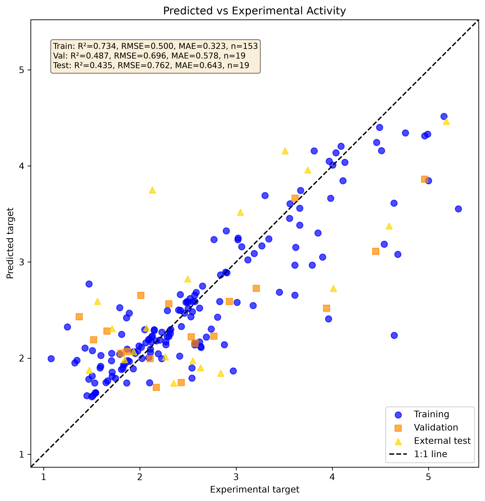
  - Williams: 
  - Residuals: 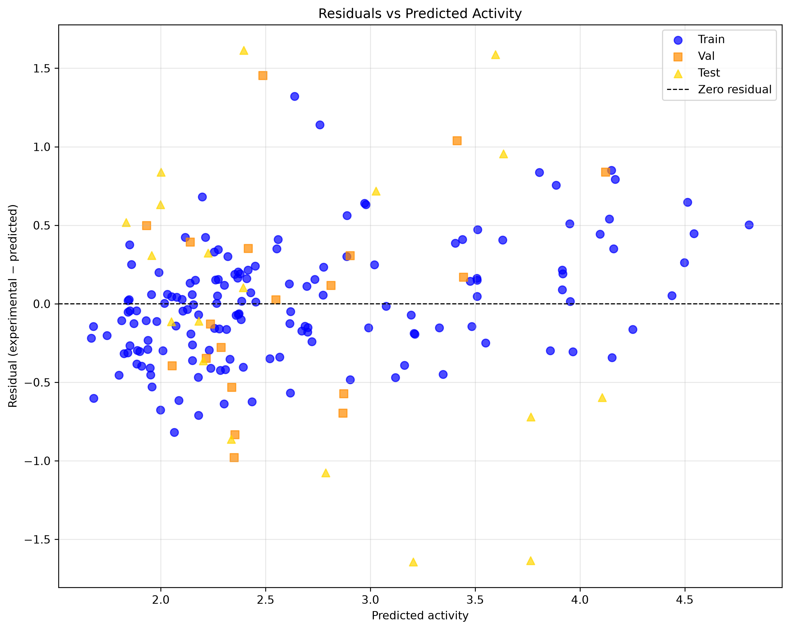
- CV predictions: `predictions/c6dc290a4a1b__random_forest__ga_cv_predictions.csv`
- Test predictions: `predictions/c6dc290a4a1b__random_forest__ga_test_predictions.csv`
- Config: `configs/c6dc290a4a1b__random_forest__ga_config.json`
- Pipeline: `models/c6dc290a4a1b__random_forest__ga_pipeline.joblib`
- AD method: `williams_leverage`
- Warning leverage: 0.176471
- Residual threshold: 3.000000
- Structural outlier IDs: ['compound_133', 'compound_180', 'compound_36', 'compound_178', 'compound_141', 'compound_119', 'compound_182']
- Response outlier IDs: ['compound_71', 'compound_167']
- AD handling: `informational_only` — Williams-plot applicability domain is a diagnostic report. Structural and response outliers were not excluded from training and were not used for model selection.

### `c6dc290a4a1b__random_forest__sfs_subset`

<!-- canonical_metrics run_id=c6dc290a4a1b__random_forest__sfs_subset train_r2=0.932095 cv_r2=0.538443 val_r2=0.511149 train_cv_r2_gap=0.386402 cv_r2_std=0.068487 -->

- Representation: RDKit
- Feature-selection method: `sfs_subset`
- Model: `RandomForestRegressor`
- Hyperparameters: `{"bootstrap": true, "criterion": "squared_error", "max_depth": 10, "max_features": "sqrt", "max_samples": null, "min_samples_leaf": 1, "min_samples_split": 2, "n_estimators": 100}`
- Feature count: 6
- Selected features: `RDKit_BCUT2D_MWLOW`, `RDKit_EState_VSA2`, `RDKit_MaxAbsPartialCharge`, `RDKit_SMR_VSA6`, `RDKit_SlogP_VSA10`, `RDKit_fr_ether`
- Train r2/rmse/mae: 0.932095 / 0.252669 / 0.199925
- CV r2/rmse/mae (std): 0.538443 / 0.643912 / 0.495418 (0.068487)
- Train–CV gap: 0.386402
- Validation r2/rmse/mae: 0.511149 / 0.678990 / 0.556112
- Runtime (s): 32.989495
- Status: completed
- Winner: False
- Diagnostic flags: status=overfit, acceptable=False, overfit=True, underfit=False, unstable=False, severe_overfit=True
- Warnings:
  - Severe overfitting: train-CV R² gap (0.386) exceeds 0.25.
- Errors: none
- Per-fold scores:
  - fold 1: train_r2=0.927045, val_r2=0.456715, train_rmse=0.273990, val_rmse=0.541865
  - fold 2: train_r2=0.926283, val_r2=0.643561, train_rmse=0.263607, val_rmse=0.573907
  - fold 3: train_r2=0.923506, val_r2=0.565720, train_rmse=0.262662, val_rmse=0.687266
  - fold 4: train_r2=0.920374, val_r2=0.556098, train_rmse=0.264929, val_rmse=0.717204
  - fold 5: train_r2=0.927018, val_r2=0.470123, train_rmse=0.262145, val_rmse=0.699319
- Plots:
  - Observed vs predicted: 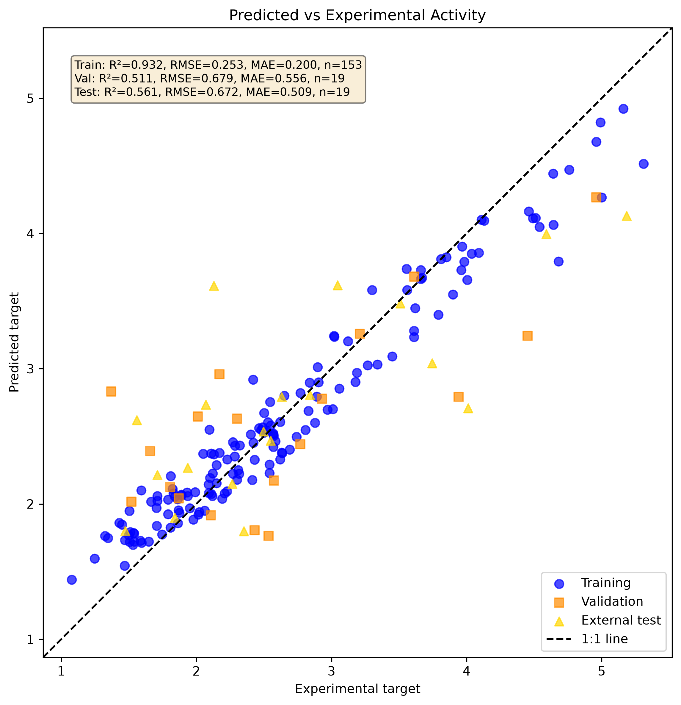
  - Williams: 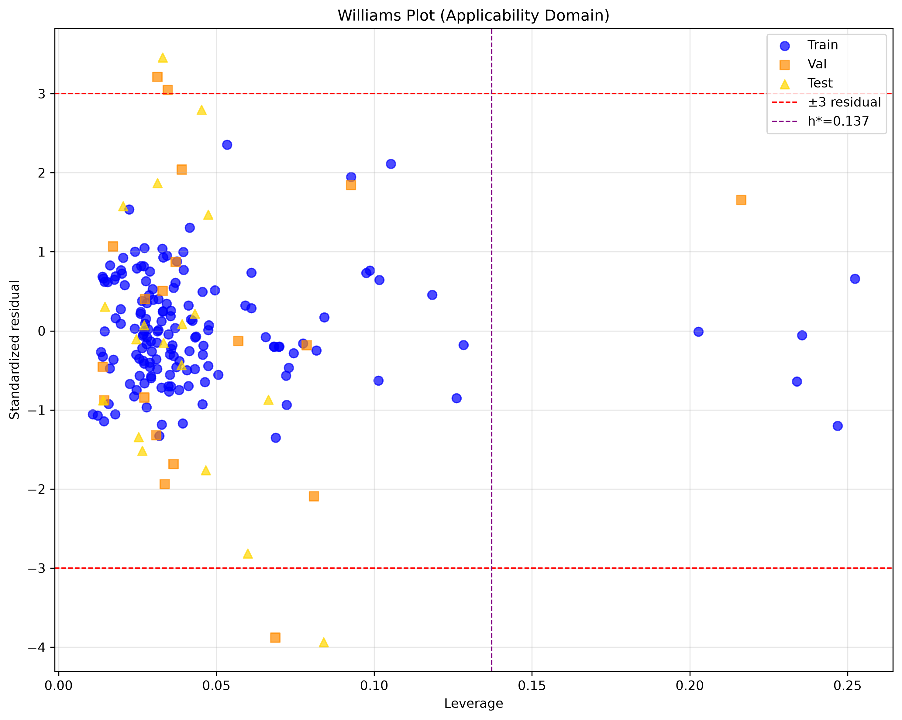
  - Residuals: 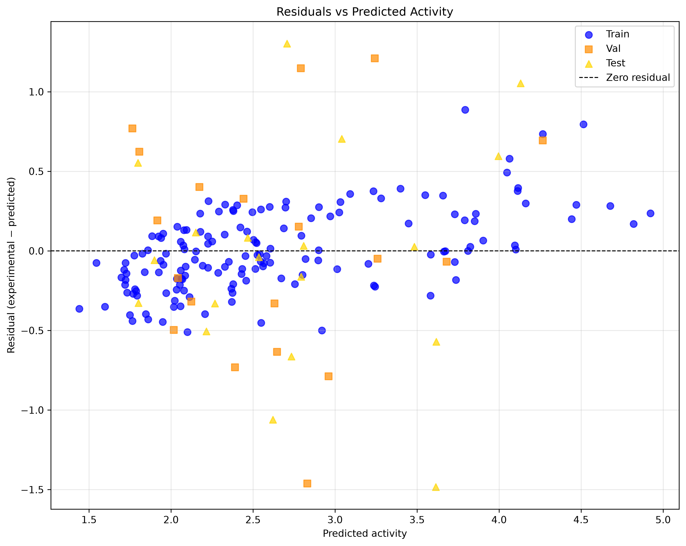
- CV predictions: `predictions/c6dc290a4a1b__random_forest__sfs_subset_cv_predictions.csv`
- Test predictions: `predictions/c6dc290a4a1b__random_forest__sfs_subset_test_predictions.csv`
- Config: `configs/c6dc290a4a1b__random_forest__sfs_subset_config.json`
- Pipeline: `models/c6dc290a4a1b__random_forest__sfs_subset_pipeline.joblib`
- AD method: `williams_leverage`
- Warning leverage: 0.137255
- Residual threshold: 3.000000
- Structural outlier IDs: ['compound_121', 'compound_36', 'compound_178', 'compound_134', 'compound_141', 'compound_119']
- Response outlier IDs: ['compound_163', 'compound_186', 'compound_42', 'compound_131', 'compound_185']
- AD handling: `informational_only` — Williams-plot applicability domain is a diagnostic report. Structural and response outliers were not excluded from training and were not used for model selection.

### `c6dc290a4a1b__random_forest__sfs_fixed_ga_plus2`

<!-- canonical_metrics run_id=c6dc290a4a1b__random_forest__sfs_fixed_ga_plus2 train_r2=0.846859 cv_r2=0.491431 val_r2=0.430661 train_cv_r2_gap=0.366965 cv_r2_std=0.063165 -->

- Representation: RDKit
- Feature-selection method: `sfs_fixed_ga_plus2`
- Model: `RandomForestRegressor`
- Hyperparameters: `{"bootstrap": false, "criterion": "squared_error", "max_depth": 5, "max_features": "log2", "max_samples": null, "min_samples_leaf": 1, "min_samples_split": 2, "n_estimators": 100}`
- Feature count: 8
- Selected features: `RDKit_BCUT2D_MWLOW`, `RDKit_EState_VSA2`, `RDKit_MaxAbsPartialCharge`, `RDKit_SMR_VSA6`, `RDKit_SlogP_VSA10`, `RDKit_fr_ether`, `RDKit_NumHAcceptors`, `RDKit_SlogP_VSA11`
- Train r2/rmse/mae: 0.846859 / 0.379444 / 0.304289
- CV r2/rmse/mae (std): 0.491431 / 0.680670 / 0.524717 (0.063165)
- Train–CV gap: 0.366965
- Validation r2/rmse/mae: 0.430661 / 0.732758 / 0.592612
- Runtime (s): 264.124402
- Status: completed
- Winner: False
- Diagnostic flags: status=overfit, acceptable=False, overfit=True, underfit=False, unstable=False, severe_overfit=True
- Warnings:
  - Severe overfitting: train-CV R² gap (0.367) exceeds 0.25.
  - CV R² (0.491) is below minimum threshold.
  - No acceptable model found after HPO; selected highest combined R² candidate. Final model may still be overfit, unstable, or poor-performing.
- Errors: none
- Per-fold scores:
  - fold 1: train_r2=0.860413, val_r2=0.523619, train_rmse=0.378992, val_rmse=0.507405
  - fold 2: train_r2=0.856134, val_r2=0.546020, train_rmse=0.368260, val_rmse=0.647689
  - fold 3: train_r2=0.862779, val_r2=0.528483, train_rmse=0.351797, val_rmse=0.716124
  - fold 4: train_r2=0.847304, val_r2=0.488222, train_rmse=0.366872, val_rmse=0.770087
  - fold 5: train_r2=0.865349, val_r2=0.370808, train_rmse=0.356072, val_rmse=0.762043
- Plots:
  - Observed vs predicted: 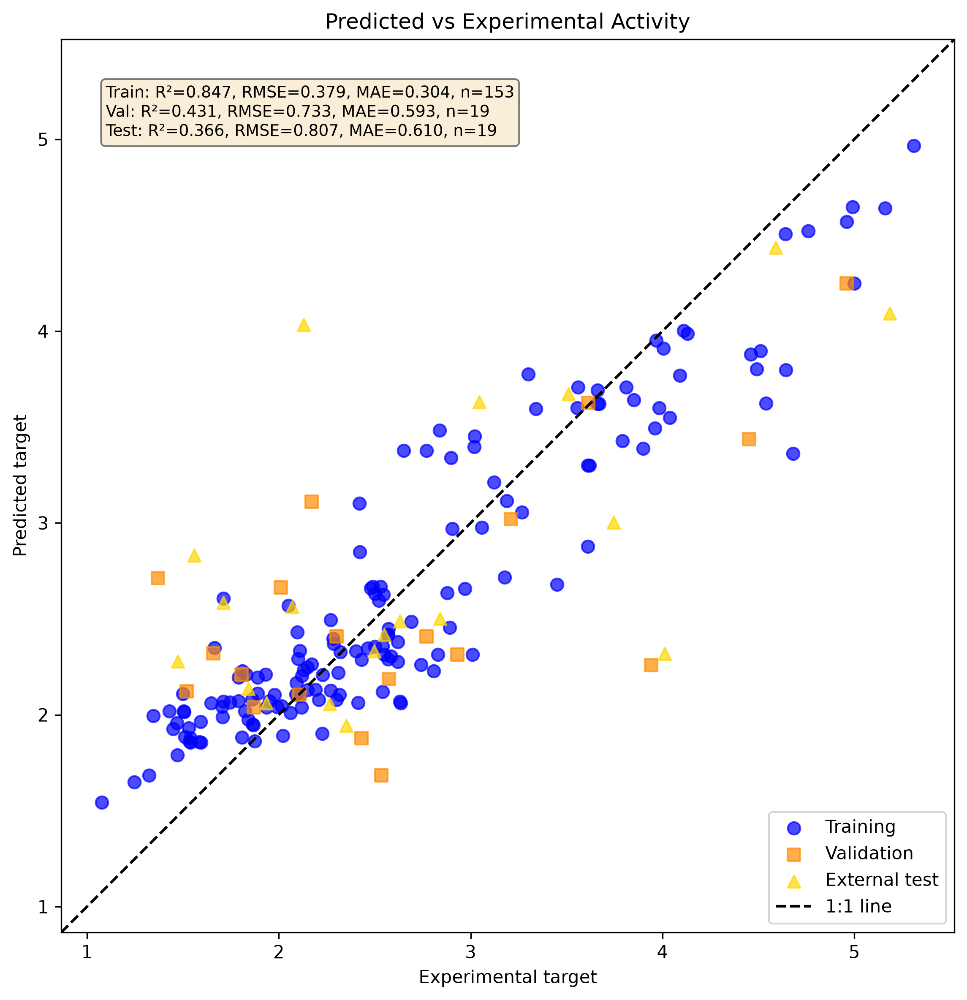
  - Williams: 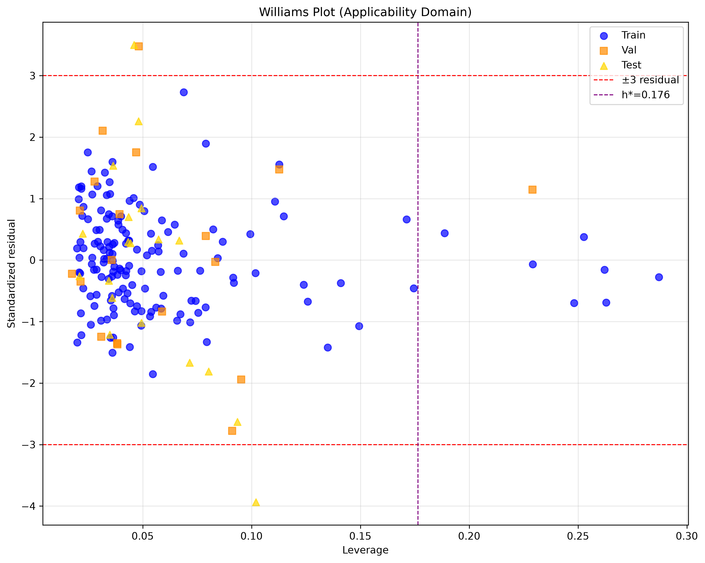
  - Residuals: 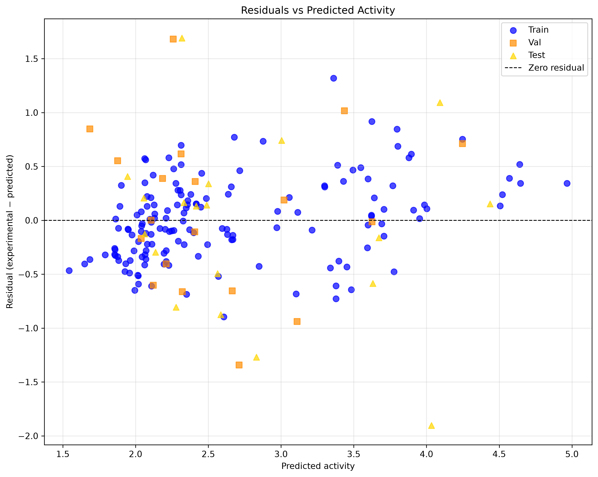
- CV predictions: `predictions/c6dc290a4a1b__random_forest__sfs_fixed_ga_plus2_cv_predictions.csv`
- Test predictions: `predictions/c6dc290a4a1b__random_forest__sfs_fixed_ga_plus2_test_predictions.csv`
- Config: `configs/c6dc290a4a1b__random_forest__sfs_fixed_ga_plus2_config.json`
- Pipeline: `models/c6dc290a4a1b__random_forest__sfs_fixed_ga_plus2_pipeline.joblib`
- AD method: `williams_leverage`
- Warning leverage: 0.176471
- Residual threshold: 3.000000
- Structural outlier IDs: ['compound_121', 'compound_133', 'compound_36', 'compound_178', 'compound_134', 'compound_30', 'compound_141', 'compound_119']
- Response outlier IDs: ['compound_186', 'compound_131', 'compound_185']
- AD handling: `informational_only` — Williams-plot applicability domain is a diagnostic report. Structural and response outliers were not excluded from training and were not used for model selection.

### `c6dc290a4a1b__pls_regression__ga`

<!-- canonical_metrics run_id=c6dc290a4a1b__pls_regression__ga train_r2=0.280630 cv_r2=0.239090 val_r2=0.150820 train_cv_r2_gap=0.041987 cv_r2_std=0.124802 -->

- Representation: RDKit
- Feature-selection method: `ga`
- Model: `PLSRegression`
- Hyperparameters: `{"max_iter": 100, "n_components": 1, "scale": false}`
- Feature count: 1
- Selected features: `RDKit_BCUT2D_LOGPHI`
- Train r2/rmse/mae: 0.280630 / 0.822391 / 0.642949
- CV r2/rmse/mae (std): 0.239090 / 0.000000 / 0.000000 (0.124802)
- Train–CV gap: 0.041987
- Validation r2/rmse/mae: 0.150820 / 0.894901 / 0.704375
- Runtime (s): 36.311836
- Status: completed
- Winner: False
- Diagnostic flags: status=underfit, acceptable=False, overfit=False, underfit=True, unstable=False, severe_overfit=False
- Warnings:
  - CV R² (0.239) is below minimum threshold.
  - No acceptable model found after HPO; selected highest combined R² candidate. Final model may still be overfit, unstable, or poor-performing.
- Errors: none
- Per-fold scores:
  - fold 1: train_r2=0.302072, val_r2=0.014968, train_rmse=0.847448, val_rmse=0.729630
  - fold 2: train_r2=0.270287, val_r2=0.316376, train_rmse=0.829375, val_rmse=0.794799
  - fold 3: train_r2=0.294793, val_r2=0.230617, train_rmse=0.797517, val_rmse=0.914768
  - fold 4: train_r2=0.286723, val_r2=0.247676, train_rmse=0.792922, val_rmse=0.933688
  - fold 5: train_r2=0.251514, val_r2=0.385815, train_rmse=0.839508, val_rmse=0.752900
- Plots:
  - Observed vs predicted: 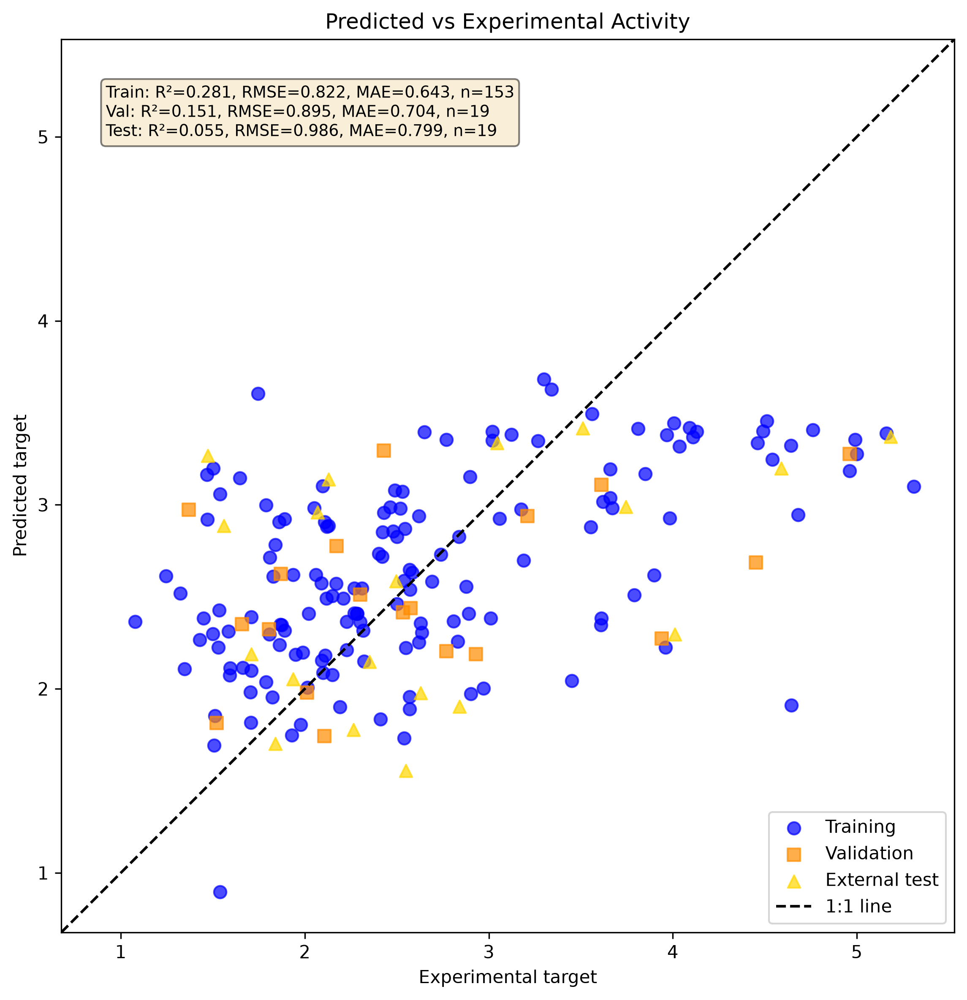
  - Williams: 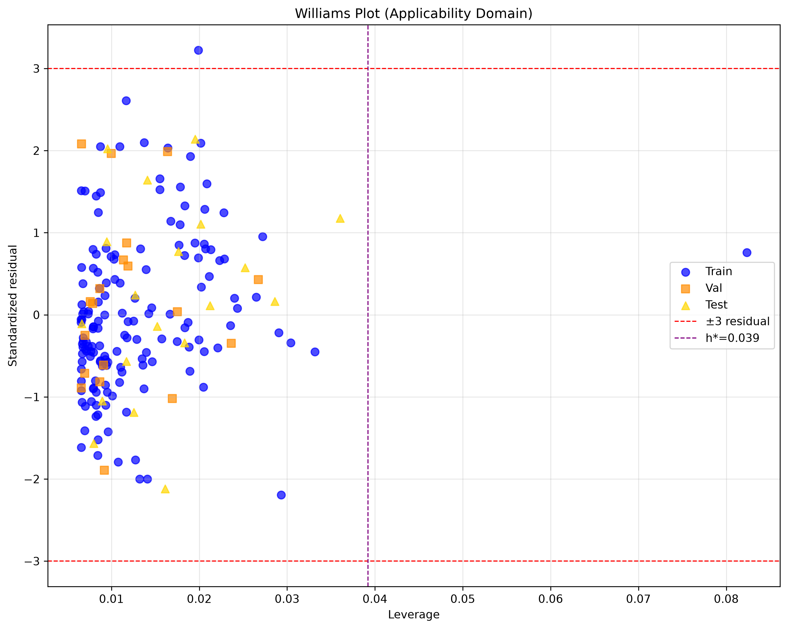
  - Residuals: 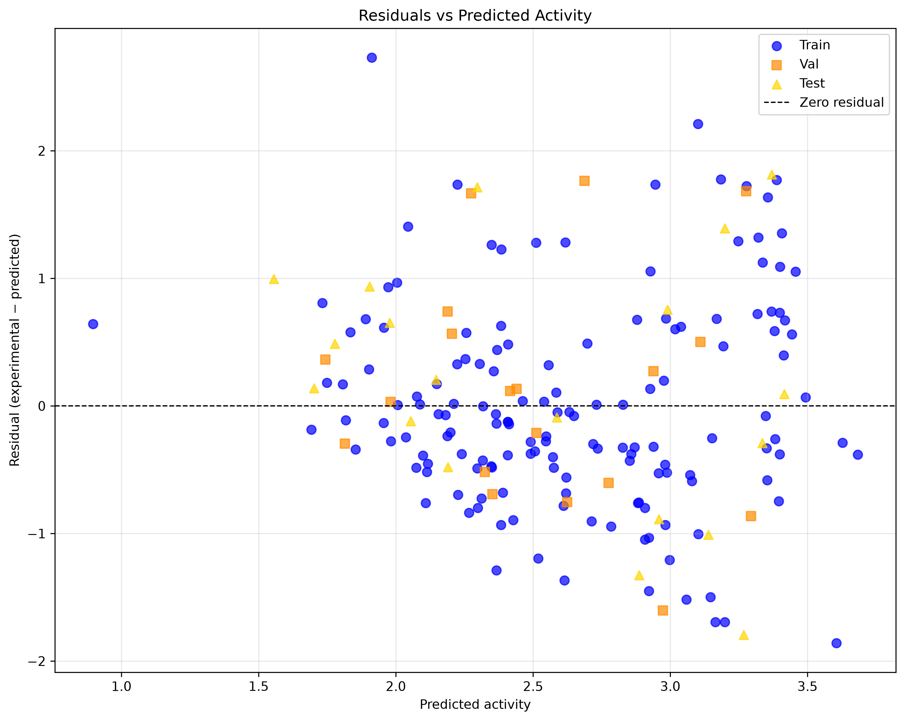
- CV predictions: `predictions/c6dc290a4a1b__pls_regression__ga_cv_predictions.csv`
- Test predictions: `predictions/c6dc290a4a1b__pls_regression__ga_test_predictions.csv`
- Config: `configs/c6dc290a4a1b__pls_regression__ga_config.json`
- Pipeline: `models/c6dc290a4a1b__pls_regression__ga_pipeline.joblib`
- AD method: `williams_leverage`
- Warning leverage: 0.039216
- Residual threshold: 3.000000
- Structural outlier IDs: ['compound_128']
- Response outlier IDs: ['compound_71']
- AD handling: `informational_only` — Williams-plot applicability domain is a diagnostic report. Structural and response outliers were not excluded from training and were not used for model selection.

### `c6dc290a4a1b__pls_regression__sfs_fixed_ga_plus2`

<!-- canonical_metrics run_id=c6dc290a4a1b__pls_regression__sfs_fixed_ga_plus2 train_r2=0.368030 cv_r2=0.316284 val_r2=0.050828 train_cv_r2_gap=0.052574 cv_r2_std=0.139249 -->

- Representation: RDKit
- Feature-selection method: `sfs_fixed_ga_plus2`
- Model: `PLSRegression`
- Hyperparameters: `{"max_iter": 100, "n_components": 2, "scale": false}`
- Feature count: 3
- Selected features: `RDKit_BCUT2D_LOGPHI`, `RDKit_BCUT2D_CHGHI`, `RDKit_SlogP_VSA7`
- Train r2/rmse/mae: 0.368030 / 0.770815 / 0.597716
- CV r2/rmse/mae (std): 0.316284 / 0.000000 / 0.000000 (0.139249)
- Train–CV gap: 0.052574
- Validation r2/rmse/mae: 0.050828 / 0.946123 / 0.711253
- Runtime (s): 33.832279
- Status: completed
- Winner: False
- Diagnostic flags: status=underfit, acceptable=False, overfit=False, underfit=True, unstable=False, severe_overfit=False
- Warnings:
  - CV R² (0.316) is below minimum threshold.
  - No acceptable model found after HPO; selected highest combined R² candidate. Final model may still be overfit, unstable, or poor-performing.
- Errors: none
- Per-fold scores:
  - fold 1: train_r2=0.401507, val_r2=0.091490, train_rmse=0.784761, val_rmse=0.700716
  - fold 2: train_r2=0.352441, val_r2=0.449685, train_rmse=0.781294, val_rmse=0.713106
  - fold 3: train_r2=0.358863, val_r2=0.405544, train_rmse=0.760427, val_rmse=0.804081
  - fold 4: train_r2=0.387953, val_r2=0.215729, train_rmse=0.734503, val_rmse=0.953306
  - fold 5: train_r2=0.343529, val_r2=0.418974, train_rmse=0.786214, val_rmse=0.732295
- Plots:
  - Observed vs predicted: 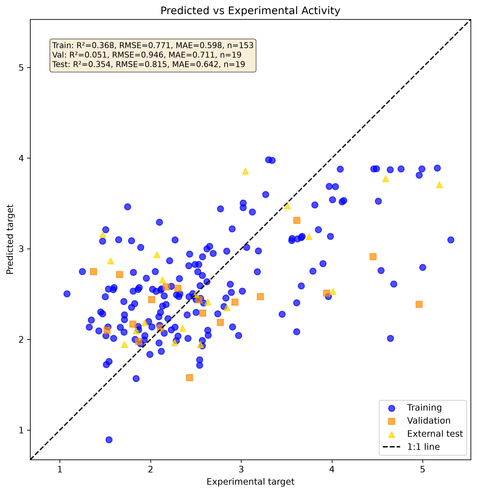
  - Williams: 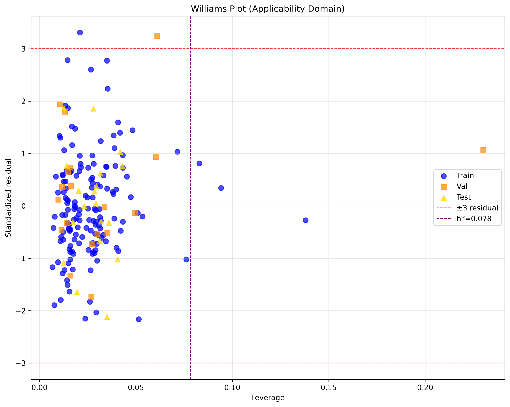
  - Residuals: 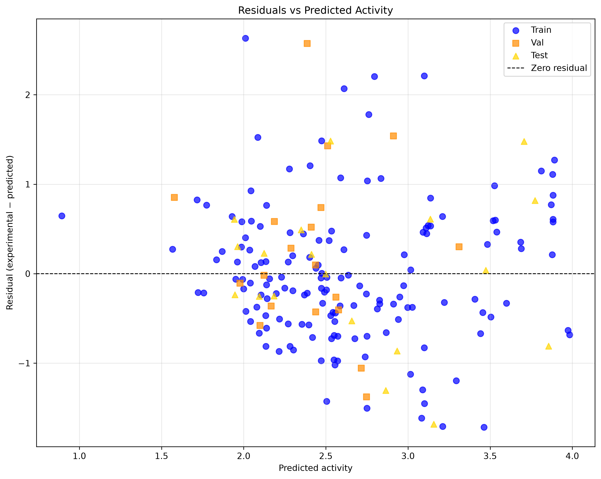
- CV predictions: `predictions/c6dc290a4a1b__pls_regression__sfs_fixed_ga_plus2_cv_predictions.csv`
- Test predictions: `predictions/c6dc290a4a1b__pls_regression__sfs_fixed_ga_plus2_test_predictions.csv`
- Config: `configs/c6dc290a4a1b__pls_regression__sfs_fixed_ga_plus2_config.json`
- Pipeline: `models/c6dc290a4a1b__pls_regression__sfs_fixed_ga_plus2_pipeline.joblib`
- AD method: `williams_leverage`
- Warning leverage: 0.078431
- Residual threshold: 3.000000
- Structural outlier IDs: ['compound_121', 'compound_128', 'compound_133', 'compound_119']
- Response outlier IDs: ['compound_71', 'compound_142']
- AD handling: `informational_only` — Williams-plot applicability domain is a diagnostic report. Structural and response outliers were not excluded from training and were not used for model selection.

### `c6dc290a4a1b__extra_trees_regressor__ga`

<!-- canonical_metrics run_id=c6dc290a4a1b__extra_trees_regressor__ga train_r2=0.925815 cv_r2=0.526929 val_r2=0.651226 train_cv_r2_gap=0.421084 cv_r2_std=0.092938 -->

- Representation: RDKit
- Feature-selection method: `ga`
- Model: `ExtraTreesRegressor`
- Hyperparameters: `{"bootstrap": false, "max_depth": 10, "max_features": "sqrt", "min_samples_leaf": 1, "min_samples_split": 2, "n_estimators": 100}`
- Feature count: 8
- Selected features: `RDKit_MinPartialCharge`, `RDKit_SMR_VSA10`, `RDKit_SMR_VSA9`, `RDKit_SPS`, `RDKit_SlogP_VSA11`, `RDKit_fr_alkyl_halide`, `RDKit_fr_aniline`, `RDKit_fr_nitro_arom`
- Train r2/rmse/mae: 0.925815 / 0.264095 / 0.188245
- CV r2/rmse/mae (std): 0.526929 / 0.654630 / 0.486675 (0.092938)
- Train–CV gap: 0.421084
- Validation r2/rmse/mae: 0.651226 / 0.573518 / 0.458334
- Runtime (s): 313.080988
- Status: completed
- Winner: False
- Diagnostic flags: status=overfit, acceptable=False, overfit=True, underfit=False, unstable=False, severe_overfit=True
- Warnings:
  - Severe overfitting: train-CV R² gap (0.421) exceeds 0.25.
  - No acceptable model found after HPO; selected highest combined R² candidate. Final model may still be overfit, unstable, or poor-performing.
- Errors: none
- Per-fold scores:
  - fold 1: train_r2=0.951143, val_r2=0.540744, train_rmse=0.224218, val_rmse=0.498201
  - fold 2: train_r2=0.954422, val_r2=0.681935, train_rmse=0.207278, val_rmse=0.542134
  - fold 3: train_r2=0.946204, val_r2=0.519127, train_rmse=0.220271, val_rmse=0.723194
  - fold 4: train_r2=0.949462, val_r2=0.500942, train_rmse=0.211063, val_rmse=0.760457
  - fold 5: train_r2=0.938835, val_r2=0.391897, train_rmse=0.239985, val_rmse=0.749163
- Plots:
  - Observed vs predicted: 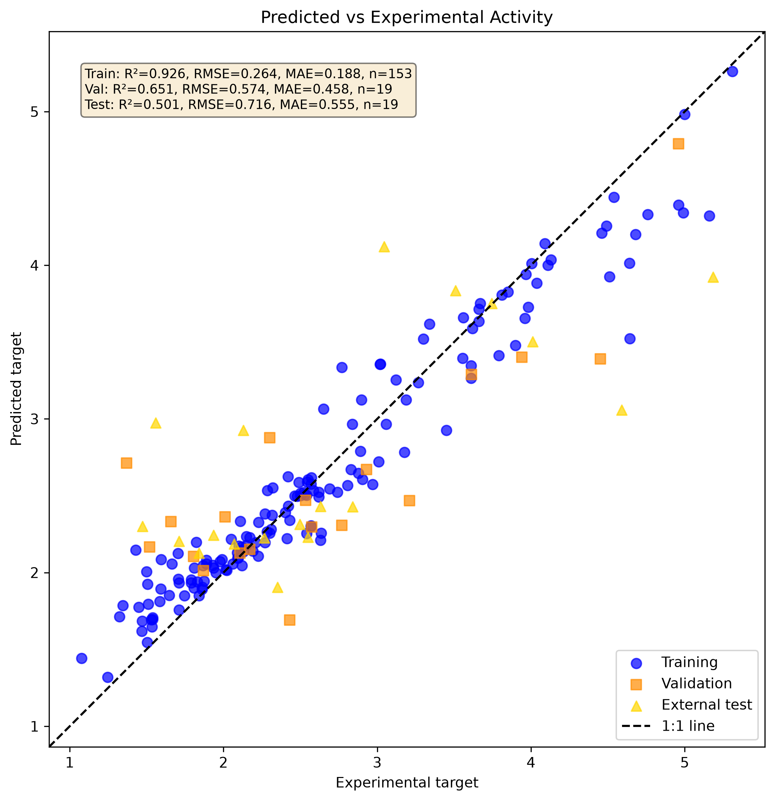
  - Williams: 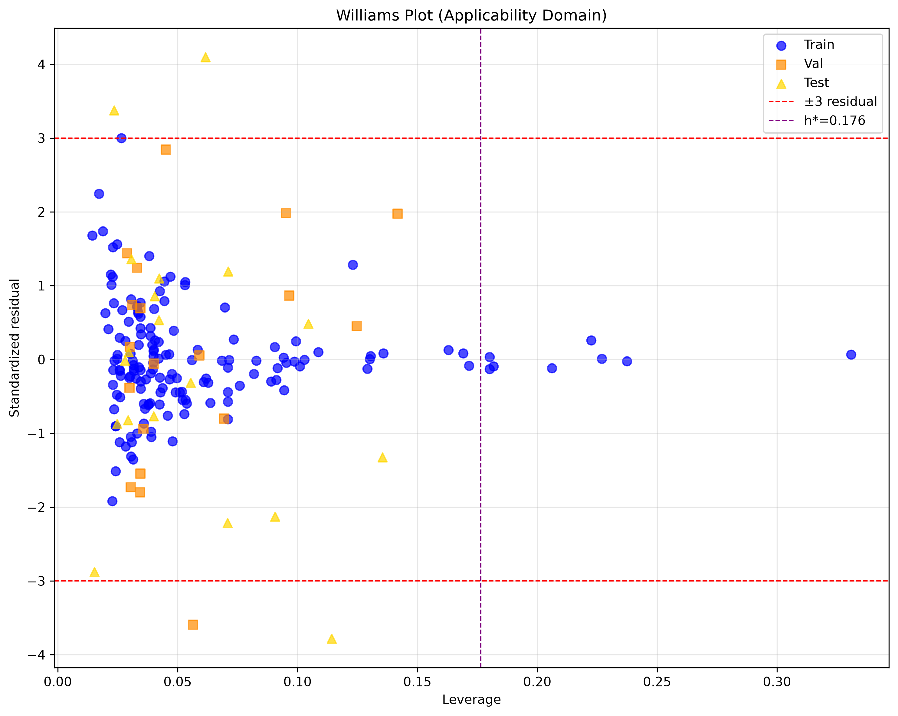
  - Residuals: 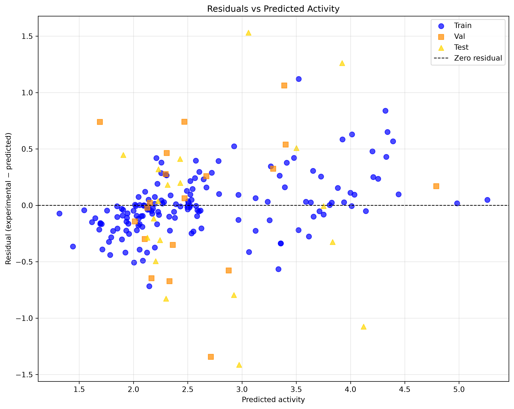
- CV predictions: `predictions/c6dc290a4a1b__extra_trees_regressor__ga_cv_predictions.csv`
- Test predictions: `predictions/c6dc290a4a1b__extra_trees_regressor__ga_test_predictions.csv`
- Config: `configs/c6dc290a4a1b__extra_trees_regressor__ga_config.json`
- Pipeline: `models/c6dc290a4a1b__extra_trees_regressor__ga_pipeline.joblib`
- AD method: `williams_leverage`
- Warning leverage: 0.176471
- Residual threshold: 3.000000
- Structural outlier IDs: ['compound_7', 'compound_133', 'compound_70', 'compound_90', 'compound_89', 'compound_0', 'compound_141', 'compound_184']
- Response outlier IDs: ['compound_163', 'compound_140', 'compound_146', 'compound_64']
- AD handling: `informational_only` — Williams-plot applicability domain is a diagnostic report. Structural and response outliers were not excluded from training and were not used for model selection.

### `c6dc290a4a1b__extra_trees_regressor__sfs_subset`

<!-- canonical_metrics run_id=c6dc290a4a1b__extra_trees_regressor__sfs_subset train_r2=0.921958 cv_r2=0.560482 val_r2=0.674236 train_cv_r2_gap=0.382470 cv_r2_std=0.111129 -->

- Representation: RDKit
- Feature-selection method: `sfs_subset`
- Model: `ExtraTreesRegressor`
- Hyperparameters: `{"bootstrap": false, "max_depth": 10, "max_features": "sqrt", "min_samples_leaf": 1, "min_samples_split": 2, "n_estimators": 100}`
- Feature count: 8
- Selected features: `RDKit_EState_VSA10`, `RDKit_HallKierAlpha`, `RDKit_MaxAbsPartialCharge`, `RDKit_PEOE_VSA11`, `RDKit_PEOE_VSA2`, `RDKit_SlogP_VSA11`, `RDKit_SlogP_VSA8`, `RDKit_fr_NH1`
- Train r2/rmse/mae: 0.921958 / 0.270873 / 0.191665
- CV r2/rmse/mae (std): 0.560482 / 0.628038 / 0.476423 (0.111129)
- Train–CV gap: 0.382470
- Validation r2/rmse/mae: 0.674236 / 0.554277 / 0.461710
- Runtime (s): 31.530772
- Status: completed
- Winner: False
- Diagnostic flags: status=overfit, acceptable=False, overfit=True, underfit=False, unstable=False, severe_overfit=True
- Warnings:
  - Severe overfitting: train-CV R² gap (0.382) exceeds 0.25.
- Errors: none
- Per-fold scores:
  - fold 1: train_r2=0.946998, val_r2=0.592836, train_rmse=0.233536, val_rmse=0.469096
  - fold 2: train_r2=0.941421, val_r2=0.618556, train_rmse=0.234988, val_rmse=0.593696
  - fold 3: train_r2=0.953523, val_r2=0.629044, train_rmse=0.204739, val_rmse=0.635186
  - fold 4: train_r2=0.935459, val_r2=0.622388, train_rmse=0.238517, val_rmse=0.661488
  - fold 5: train_r2=0.937357, val_r2=0.339584, train_rmse=0.242868, val_rmse=0.780722
- Plots:
  - Observed vs predicted: 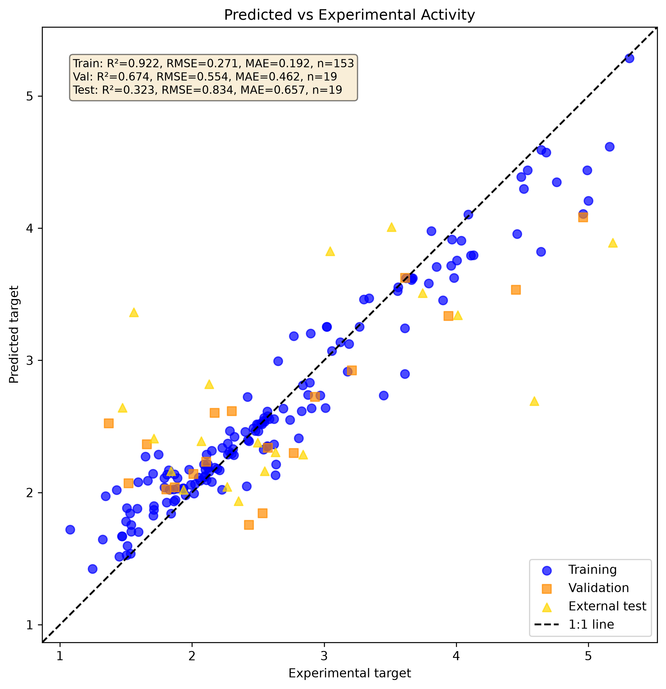
  - Williams: 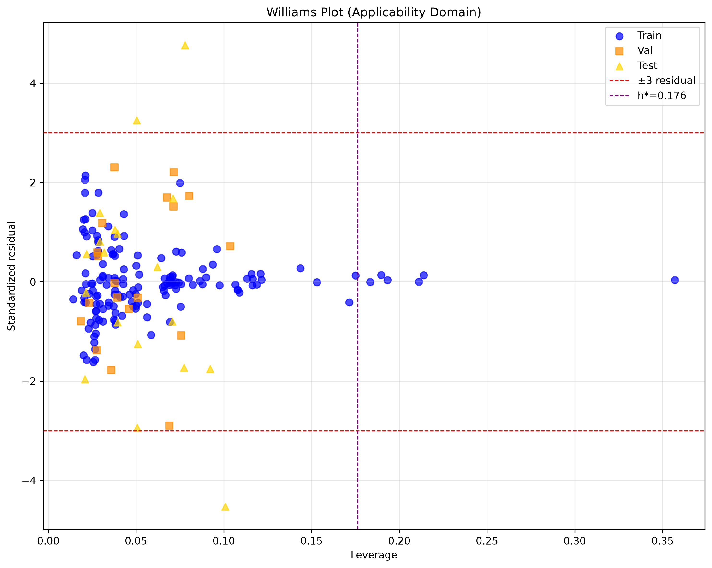
  - Residuals: 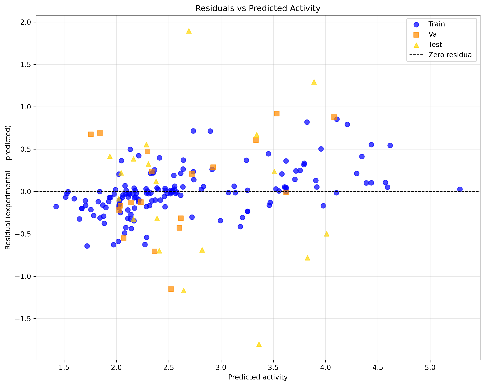
- CV predictions: `predictions/c6dc290a4a1b__extra_trees_regressor__sfs_subset_cv_predictions.csv`
- Test predictions: `predictions/c6dc290a4a1b__extra_trees_regressor__sfs_subset_test_predictions.csv`
- Config: `configs/c6dc290a4a1b__extra_trees_regressor__sfs_subset_config.json`
- Pipeline: `models/c6dc290a4a1b__extra_trees_regressor__sfs_subset_pipeline.joblib`
- AD method: `williams_leverage`
- Warning leverage: 0.176471
- Residual threshold: 3.000000
- Structural outlier IDs: ['compound_133', 'compound_132', 'compound_129', 'compound_30', 'compound_170', 'compound_141']
- Response outlier IDs: ['compound_140', 'compound_146', 'compound_64']
- AD handling: `informational_only` — Williams-plot applicability domain is a diagnostic report. Structural and response outliers were not excluded from training and were not used for model selection.

### `c6dc290a4a1b__extra_trees_regressor__sfs_fixed_ga_plus2`

<!-- canonical_metrics run_id=c6dc290a4a1b__extra_trees_regressor__sfs_fixed_ga_plus2 train_r2=0.944383 cv_r2=0.535453 val_r2=0.664191 train_cv_r2_gap=0.425973 cv_r2_std=0.111922 -->

- Representation: RDKit
- Feature-selection method: `sfs_fixed_ga_plus2`
- Model: `ExtraTreesRegressor`
- Hyperparameters: `{"bootstrap": false, "max_depth": 10, "max_features": "sqrt", "min_samples_leaf": 1, "min_samples_split": 2, "n_estimators": 100}`
- Feature count: 10
- Selected features: `RDKit_EState_VSA10`, `RDKit_HallKierAlpha`, `RDKit_MaxAbsPartialCharge`, `RDKit_PEOE_VSA11`, `RDKit_PEOE_VSA2`, `RDKit_SlogP_VSA11`, `RDKit_SlogP_VSA8`, `RDKit_fr_NH1`, `RDKit_PEOE_VSA8`, `RDKit_SMR_VSA4`
- Train r2/rmse/mae: 0.944383 / 0.228668 / 0.163928
- CV r2/rmse/mae (std): 0.535453 / 0.643358 / 0.486402 (0.111922)
- Train–CV gap: 0.425973
- Validation r2/rmse/mae: 0.664191 / 0.562757 / 0.453168
- Runtime (s): 298.843445
- Status: completed
- Winner: False
- Diagnostic flags: status=overfit, acceptable=False, overfit=True, underfit=False, unstable=False, severe_overfit=True
- Warnings:
  - Severe overfitting: train-CV R² gap (0.426) exceeds 0.25.
  - No acceptable model found after HPO; selected highest combined R² candidate. Final model may still be overfit, unstable, or poor-performing.
- Errors: none
- Per-fold scores:
  - fold 1: train_r2=0.960481, val_r2=0.502673, train_rmse=0.201657, val_rmse=0.518440
  - fold 2: train_r2=0.959824, val_r2=0.610960, train_rmse=0.194606, val_rmse=0.599577
  - fold 3: train_r2=0.969113, val_r2=0.646798, train_rmse=0.166904, val_rmse=0.619799
  - fold 4: train_r2=0.961287, val_r2=0.584095, train_rmse=0.184727, val_rmse=0.694219
  - fold 5: train_r2=0.956427, val_r2=0.332740, train_rmse=0.202555, val_rmse=0.784757
- Plots:
  - Observed vs predicted: 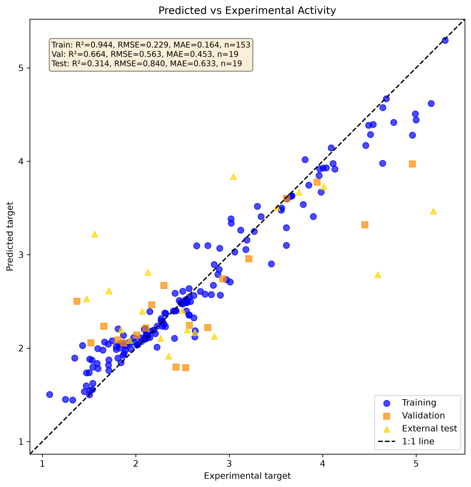
  - Williams: 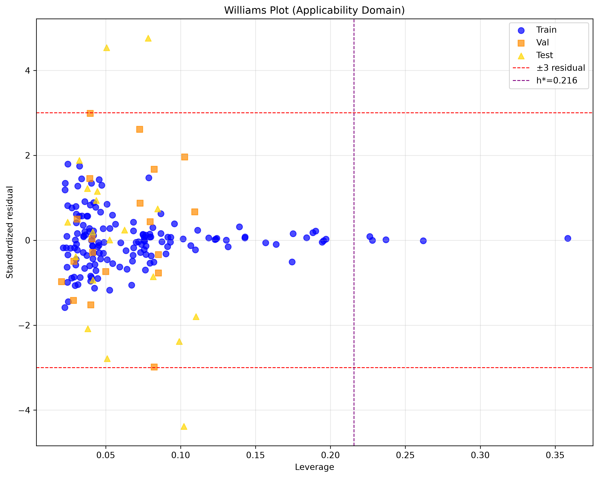
  - Residuals: 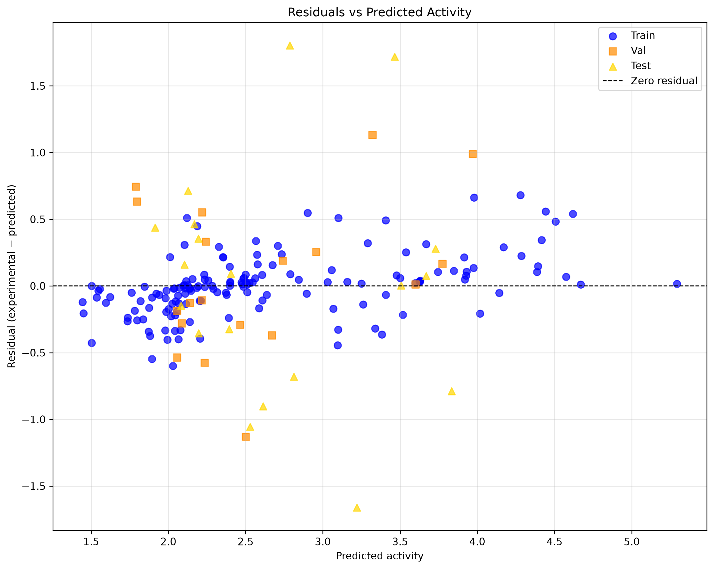
- CV predictions: `predictions/c6dc290a4a1b__extra_trees_regressor__sfs_fixed_ga_plus2_cv_predictions.csv`
- Test predictions: `predictions/c6dc290a4a1b__extra_trees_regressor__sfs_fixed_ga_plus2_test_predictions.csv`
- Config: `configs/c6dc290a4a1b__extra_trees_regressor__sfs_fixed_ga_plus2_config.json`
- Pipeline: `models/c6dc290a4a1b__extra_trees_regressor__sfs_fixed_ga_plus2_pipeline.joblib`
- AD method: `williams_leverage`
- Warning leverage: 0.215686
- Residual threshold: 3.000000
- Structural outlier IDs: ['compound_133', 'compound_36', 'compound_177', 'compound_30', 'compound_141']
- Response outlier IDs: ['compound_140', 'compound_146', 'compound_64']
- AD handling: `informational_only` — Williams-plot applicability domain is a diagnostic report. Structural and response outliers were not excluded from training and were not used for model selection.

### `c6dc290a4a1b__svr__ga`

<!-- canonical_metrics run_id=c6dc290a4a1b__svr__ga train_r2=0.527451 cv_r2=0.406400 val_r2=0.194188 train_cv_r2_gap=0.122290 cv_r2_std=0.115222 -->

- Representation: RDKit
- Feature-selection method: `ga`
- Model: `SVR`
- Hyperparameters: `{"C": 1.0, "epsilon": 0.1, "gamma": "scale", "kernel": "rbf"}`
- Feature count: 6
- Selected features: `RDKit_BCUT2D_LOGPHI`, `RDKit_ExactMolWt`, `RDKit_MaxAbsPartialCharge`, `RDKit_fr_ArN`, `RDKit_fr_NH2`, `RDKit_qed`
- Train r2/rmse/mae: 0.527451 / 0.666539 / 0.444277
- CV r2/rmse/mae (std): 0.406400 / 0.733445 / 0.527171 (0.115222)
- Train–CV gap: 0.122290
- Validation r2/rmse/mae: 0.194188 / 0.871750 / 0.661155
- Runtime (s): 44.085118
- Status: completed
- Winner: False
- Diagnostic flags: status=poor_performance, acceptable=False, overfit=False, underfit=False, unstable=False, severe_overfit=False
- Warnings:
  - No acceptable model found after HPO; selected highest combined R² candidate. Final model may still be overfit, unstable, or poor-performing.
- Errors: none
- Per-fold scores:
  - fold 1: train_r2=0.524068, val_r2=0.457640, train_rmse=0.699810, val_rmse=0.541404
  - fold 2: train_r2=0.517896, val_r2=0.500252, train_rmse=0.674133, val_rmse=0.679554
  - fold 3: train_r2=0.525832, val_r2=0.467449, train_rmse=0.653955, val_rmse=0.761062
  - fold 4: train_r2=0.503569, val_r2=0.425749, train_rmse=0.661501, val_rmse=0.815737
  - fold 5: train_r2=0.572089, val_r2=0.180911, train_rmse=0.634760, val_rmse=0.869468
- Plots:
  - Observed vs predicted: 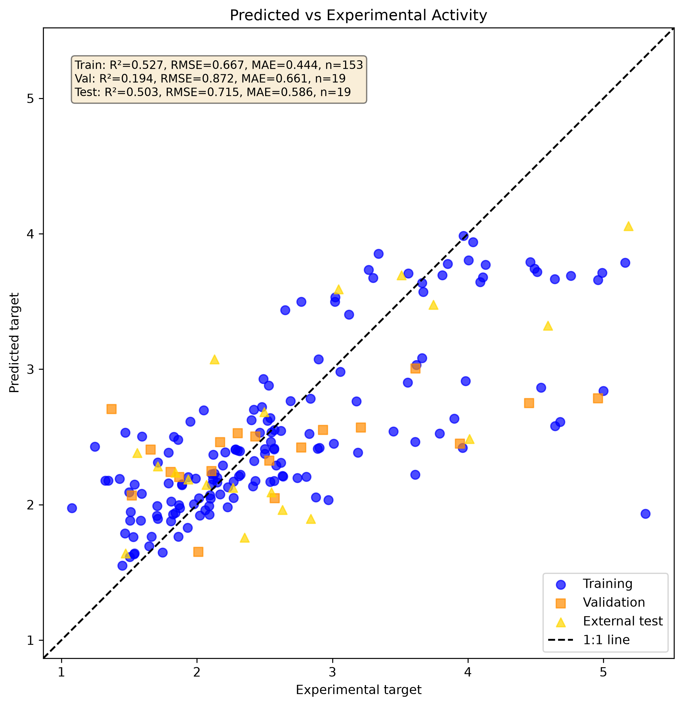
  - Williams: 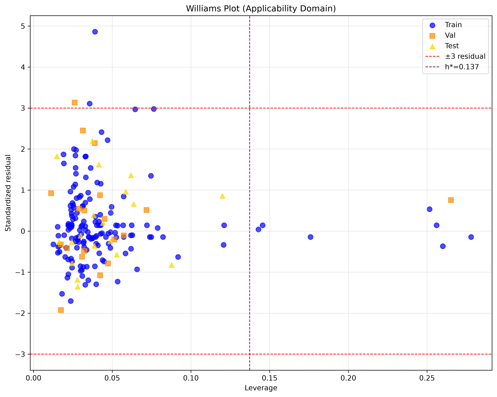
  - Residuals: 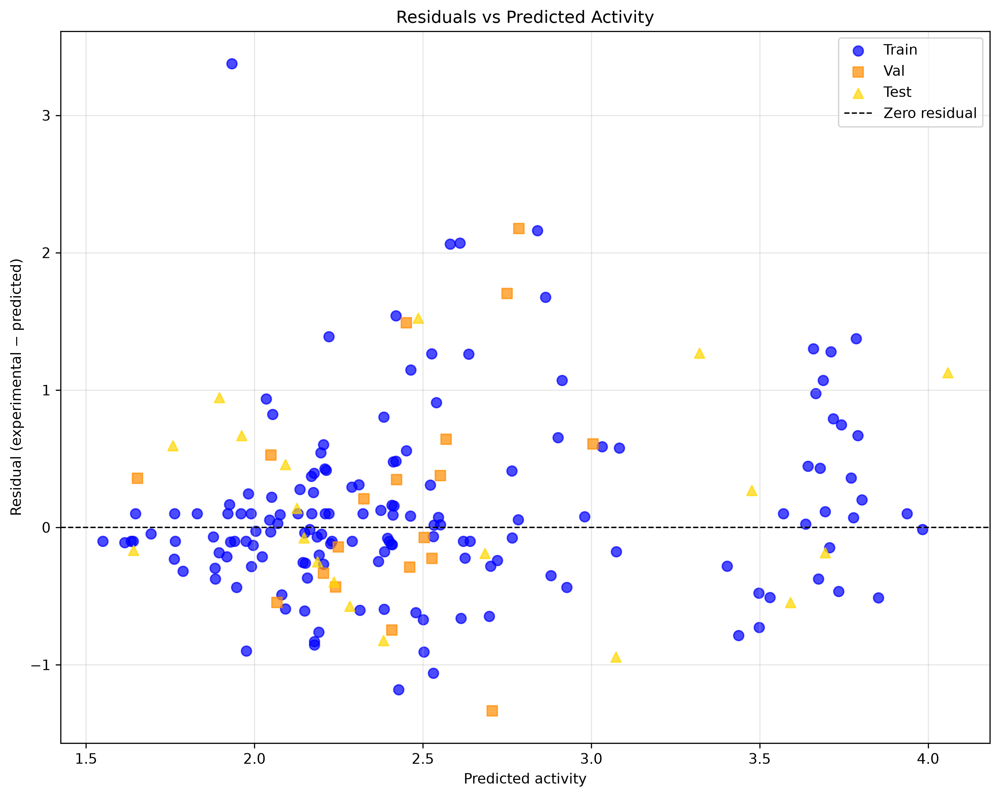
- CV predictions: `predictions/c6dc290a4a1b__svr__ga_cv_predictions.csv`
- Test predictions: `predictions/c6dc290a4a1b__svr__ga_test_predictions.csv`
- Config: `configs/c6dc290a4a1b__svr__ga_config.json`
- Pipeline: `models/c6dc290a4a1b__svr__ga_pipeline.joblib`
- AD method: `williams_leverage`
- Warning leverage: 0.137255
- Residual threshold: 3.000000
- Structural outlier IDs: ['compound_128', 'compound_133', 'compound_113', 'compound_90', 'compound_36', 'compound_88', 'compound_111', 'compound_40']
- Response outlier IDs: ['compound_143', 'compound_167', 'compound_142']
- AD handling: `informational_only` — Williams-plot applicability domain is a diagnostic report. Structural and response outliers were not excluded from training and were not used for model selection.

### `c6dc290a4a1b__svr__sfs_subset`

<!-- canonical_metrics run_id=c6dc290a4a1b__svr__sfs_subset train_r2=0.697777 cv_r2=0.522107 val_r2=0.421237 train_cv_r2_gap=0.178188 cv_r2_std=0.064034 -->

- Representation: RDKit
- Feature-selection method: `sfs_subset`
- Model: `SVR`
- Hyperparameters: `{"C": 1.0, "epsilon": 0.1, "gamma": "scale", "kernel": "rbf"}`
- Feature count: 6
- Selected features: `RDKit_BCUT2D_LOGPHI`, `RDKit_Chi2v`, `RDKit_PEOE_VSA1`, `RDKit_SlogP_VSA10`, `RDKit_SlogP_VSA11`, `RDKit_SlogP_VSA6`
- Train r2/rmse/mae: 0.697777 / 0.533047 / 0.346192
- CV r2/rmse/mae (std): 0.522107 / 0.663368 / 0.478596 (0.064034)
- Train–CV gap: 0.178188
- Validation r2/rmse/mae: 0.421237 / 0.738797 / 0.567965
- Runtime (s): 20.090917
- Status: completed
- Winner: False
- Diagnostic flags: status=overfit, acceptable=False, overfit=True, underfit=False, unstable=False, severe_overfit=False
- Warnings:
  - Train-CV R² gap (0.178) suggests overfitting.
- Errors: none
- Per-fold scores:
  - fold 1: train_r2=0.691285, val_r2=0.600545, train_rmse=0.563620, val_rmse=0.464635
  - fold 2: train_r2=0.720656, val_r2=0.505569, train_rmse=0.513150, val_rmse=0.675929
  - fold 3: train_r2=0.731534, val_r2=0.448942, train_rmse=0.492069, val_rmse=0.774173
  - fold 4: train_r2=0.685873, val_r2=0.461940, train_rmse=0.526204, val_rmse=0.789614
  - fold 5: train_r2=0.672126, val_r2=0.593538, train_rmse=0.555631, val_rmse=0.612488
- Plots:
  - Observed vs predicted: 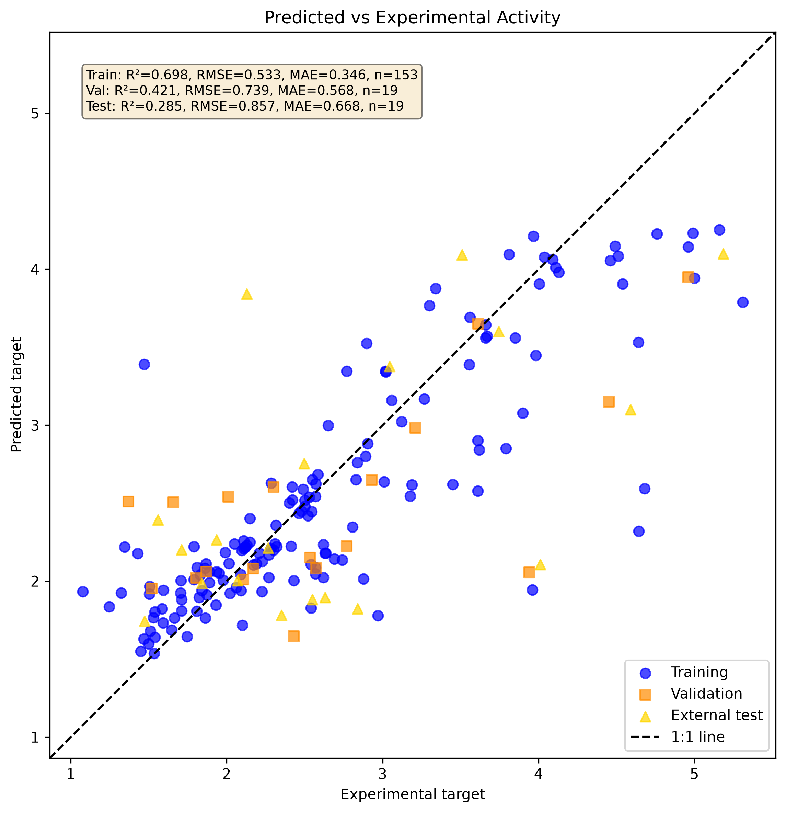
  - Williams: 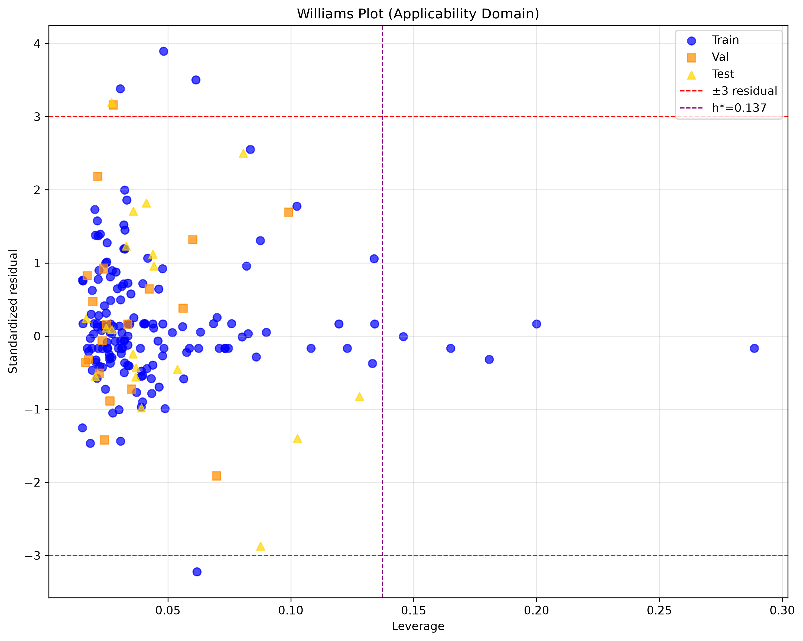
  - Residuals: 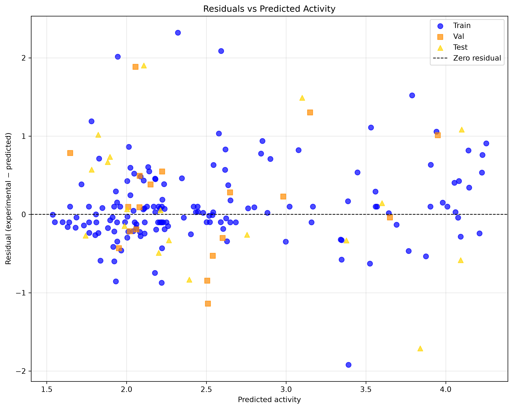
- CV predictions: `predictions/c6dc290a4a1b__svr__sfs_subset_cv_predictions.csv`
- Test predictions: `predictions/c6dc290a4a1b__svr__sfs_subset_test_predictions.csv`
- Config: `configs/c6dc290a4a1b__svr__sfs_subset_config.json`
- Pipeline: `models/c6dc290a4a1b__svr__sfs_subset_pipeline.joblib`
- AD method: `williams_leverage`
- Warning leverage: 0.137255
- Residual threshold: 3.000000
- Structural outlier IDs: ['compound_18', 'compound_133', 'compound_180', 'compound_36', 'compound_141']
- Response outlier IDs: ['compound_137', 'compound_181', 'compound_71', 'compound_179', 'compound_186', 'compound_185']
- AD handling: `informational_only` — Williams-plot applicability domain is a diagnostic report. Structural and response outliers were not excluded from training and were not used for model selection.

### `c6dc290a4a1b__svr__sfs_fixed_ga_plus2`

<!-- canonical_metrics run_id=c6dc290a4a1b__svr__sfs_fixed_ga_plus2 train_r2=0.733866 cv_r2=0.534902 val_r2=0.486991 train_cv_r2_gap=0.200894 cv_r2_std=0.076964 -->

- Representation: RDKit
- Feature-selection method: `sfs_fixed_ga_plus2`
- Model: `SVR`
- Hyperparameters: `{"C": 1.0, "epsilon": 0.1, "gamma": "scale", "kernel": "rbf"}`
- Feature count: 8
- Selected features: `RDKit_BCUT2D_LOGPHI`, `RDKit_Chi2v`, `RDKit_PEOE_VSA1`, `RDKit_SlogP_VSA10`, `RDKit_SlogP_VSA11`, `RDKit_SlogP_VSA6`, `RDKit_Kappa1`, `RDKit_NumRotatableBonds`
- Train r2/rmse/mae: 0.733866 / 0.500210 / 0.322909
- CV r2/rmse/mae (std): 0.534902 / 0.654670 / 0.455722 (0.076964)
- Train–CV gap: 0.200894
- Validation r2/rmse/mae: 0.486991 / 0.695564 / 0.578039
- Runtime (s): 41.034214
- Status: completed
- Winner: True
- Diagnostic flags: status=overfit, acceptable=False, overfit=True, underfit=False, unstable=False, severe_overfit=False
- Warnings:
  - Train-CV R² gap (0.201) suggests overfitting.
  - No acceptable model found after HPO; selected highest combined R² candidate. Final model may still be overfit, unstable, or poor-performing.
  - No acceptable model found across estimators; selected highest combined R² candidate. Final model may still be overfit, unstable, or poor-performing.
- Errors: none
- Per-fold scores:
  - fold 1: train_r2=0.725534, val_r2=0.645349, train_rmse=0.531437, val_rmse=0.437802
  - fold 2: train_r2=0.735297, val_r2=0.590895, train_rmse=0.499522, val_rmse=0.614845
  - fold 3: train_r2=0.739830, val_r2=0.535038, train_rmse=0.484407, val_rmse=0.711129
  - fold 4: train_r2=0.733453, val_r2=0.437311, train_rmse=0.484716, val_rmse=0.807483
  - fold 5: train_r2=0.744864, val_r2=0.465915, train_rmse=0.490139, val_rmse=0.702091
- Plots:
  - Observed vs predicted: 
  - Williams: 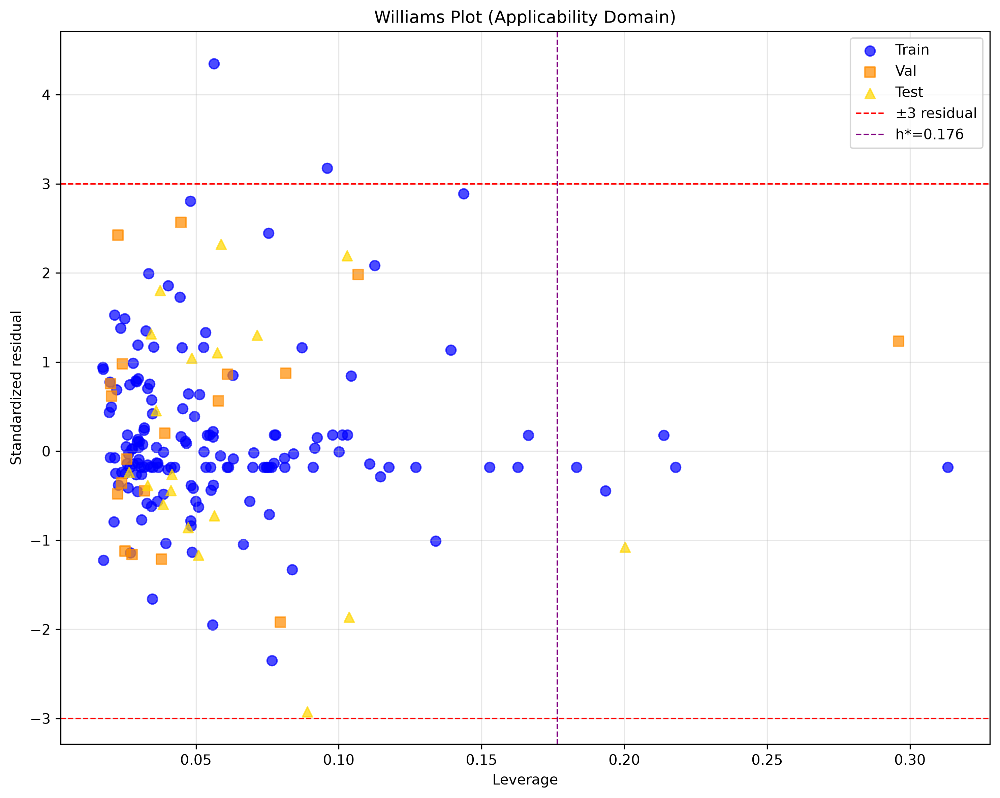
  - Residuals: 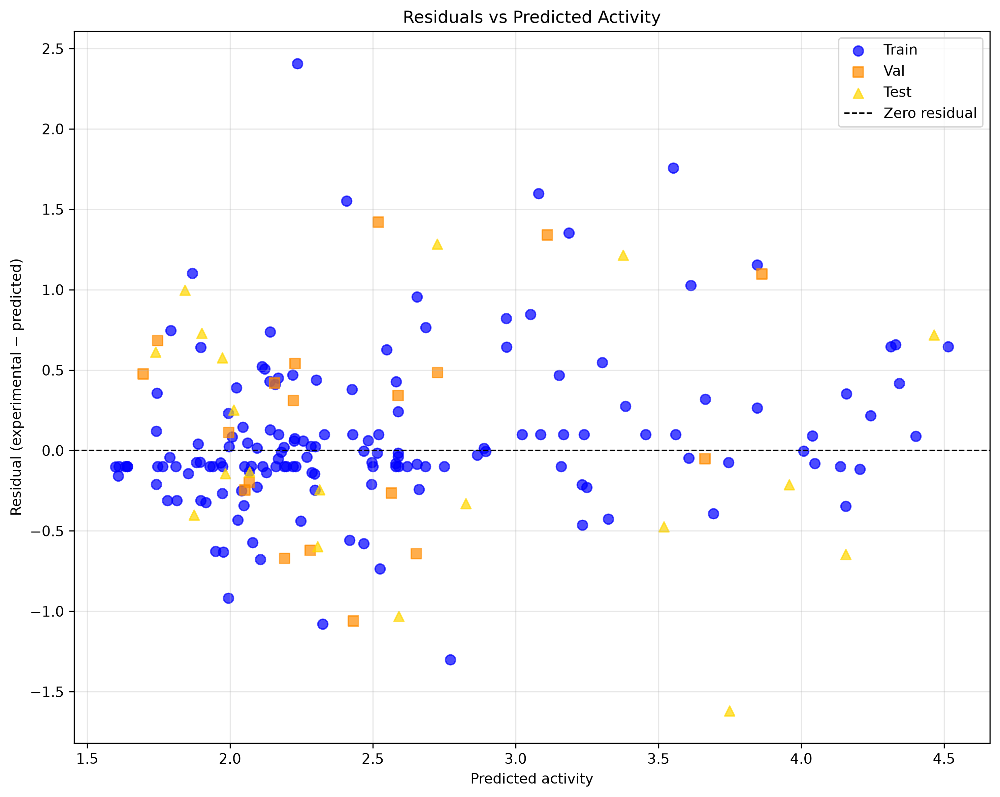
- CV predictions: `predictions/c6dc290a4a1b__svr__sfs_fixed_ga_plus2_cv_predictions.csv`
- Test predictions: `predictions/c6dc290a4a1b__svr__sfs_fixed_ga_plus2_test_predictions.csv`
- Config: `configs/c6dc290a4a1b__svr__sfs_fixed_ga_plus2_config.json`
- Pipeline: `models/c6dc290a4a1b__svr__sfs_fixed_ga_plus2_pipeline.joblib`
- AD method: `williams_leverage`
- Warning leverage: 0.176471
- Residual threshold: 3.000000
- Structural outlier IDs: ['compound_133', 'compound_180', 'compound_36', 'compound_178', 'compound_141', 'compound_119', 'compound_182']
- Response outlier IDs: ['compound_71', 'compound_167']
- AD handling: `informational_only` — Williams-plot applicability domain is a diagnostic report. Structural and response outliers were not excluded from training and were not used for model selection.

### `c6dc290a4a1b__k_neighbors_regressor__ga`

<!-- canonical_metrics run_id=c6dc290a4a1b__k_neighbors_regressor__ga train_r2=0.568579 cv_r2=0.336742 val_r2=0.314325 train_cv_r2_gap=0.218671 cv_r2_std=0.139138 -->

- Representation: RDKit
- Feature-selection method: `ga`
- Model: `KNeighborsRegressor`
- Hyperparameters: `{"metric": "minkowski", "n_neighbors": 5, "p": 2, "weights": "uniform"}`
- Feature count: 1
- Selected features: `RDKit_MinPartialCharge`
- Train r2/rmse/mae: 0.568579 / 0.636873 / 0.492311
- CV r2/rmse/mae (std): 0.336742 / 0.765461 / 0.610493 (0.139138)
- Train–CV gap: 0.218671
- Validation r2/rmse/mae: 0.314325 / 0.804145 / 0.599442
- Runtime (s): 84.009030
- Status: completed
- Winner: False
- Diagnostic flags: status=overfit, acceptable=False, overfit=True, underfit=False, unstable=False, severe_overfit=False
- Warnings:
  - Train-CV R² gap (0.219) suggests overfitting.
  - CV R² (0.337) is below minimum threshold.
  - No acceptable model found after HPO; selected highest combined R² candidate. Final model may still be overfit, unstable, or poor-performing.
- Errors: none
- Per-fold scores:
  - fold 1: train_r2=0.587908, val_r2=0.081734, train_rmse=0.651186, val_rmse=0.704469
  - fold 2: train_r2=0.565413, val_r2=0.428741, train_rmse=0.640049, val_rmse=0.726549
  - fold 3: train_r2=0.531831, val_r2=0.485522, train_rmse=0.649805, val_rmse=0.748037
  - fold 4: train_r2=0.504548, val_r2=0.366959, train_rmse=0.660848, val_rmse=0.856476
  - fold 5: train_r2=0.587365, val_r2=0.320752, train_rmse=0.623327, val_rmse=0.791775
- Plots:
  - Observed vs predicted: 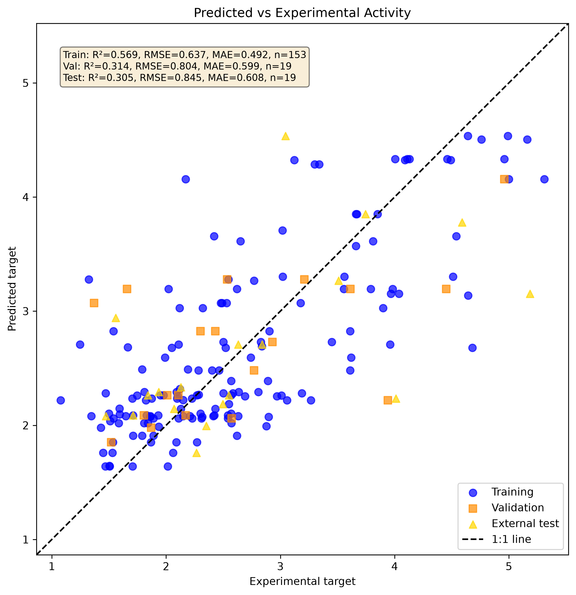
  - Williams: 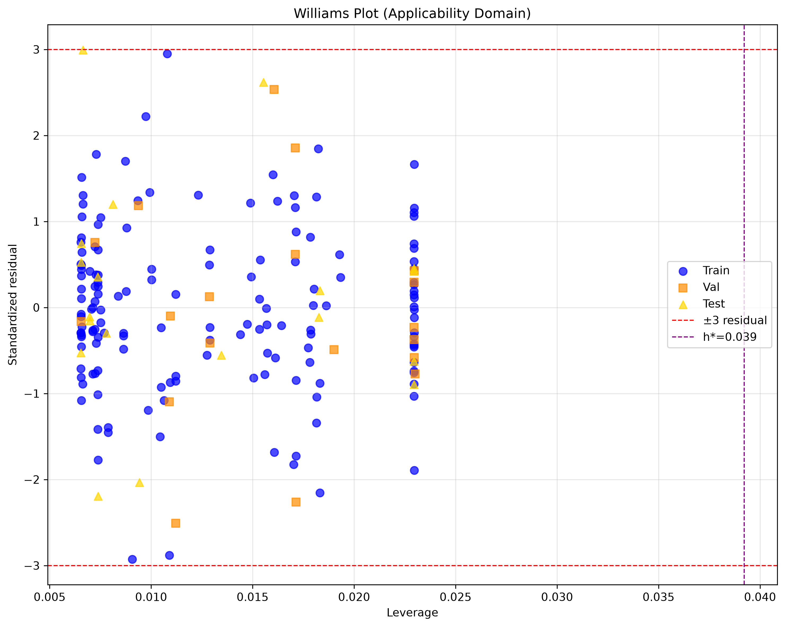
  - Residuals: 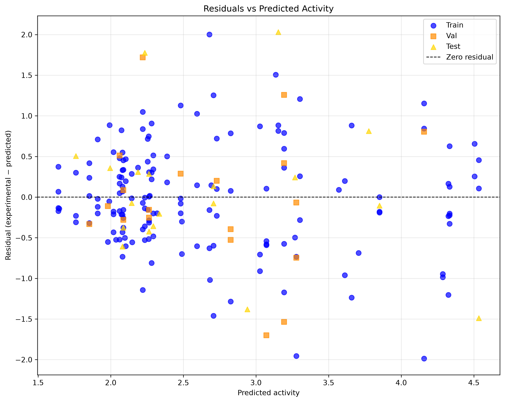
- CV predictions: `predictions/c6dc290a4a1b__k_neighbors_regressor__ga_cv_predictions.csv`
- Test predictions: `predictions/c6dc290a4a1b__k_neighbors_regressor__ga_test_predictions.csv`
- Config: `configs/c6dc290a4a1b__k_neighbors_regressor__ga_config.json`
- Pipeline: `models/c6dc290a4a1b__k_neighbors_regressor__ga_pipeline.joblib`
- AD method: `williams_leverage`
- Warning leverage: 0.039216
- Residual threshold: 3.000000
- Structural outlier IDs: none
- Response outlier IDs: none
- AD handling: `informational_only` — Williams-plot applicability domain is a diagnostic report. Structural and response outliers were not excluded from training and were not used for model selection.

### `c6dc290a4a1b__k_neighbors_regressor__sfs_fixed_ga_plus2`

<!-- canonical_metrics run_id=c6dc290a4a1b__k_neighbors_regressor__sfs_fixed_ga_plus2 train_r2=0.643118 cv_r2=0.327867 val_r2=0.160757 train_cv_r2_gap=0.294119 cv_r2_std=0.217611 -->

- Representation: RDKit
- Feature-selection method: `sfs_fixed_ga_plus2`
- Model: `KNeighborsRegressor`
- Hyperparameters: `{"metric": "minkowski", "n_neighbors": 5, "p": 2, "weights": "uniform"}`
- Feature count: 3
- Selected features: `RDKit_MinPartialCharge`, `RDKit_fr_bicyclic`, `RDKit_fr_phenol_noOrthoHbond`
- Train r2/rmse/mae: 0.643118 / 0.579247 / 0.448226
- CV r2/rmse/mae (std): 0.327867 / 0.761422 / 0.606606 (0.217611)
- Train–CV gap: 0.294119
- Validation r2/rmse/mae: 0.160757 / 0.889649 / 0.693305
- Runtime (s): 73.891657
- Status: completed
- Winner: False
- Diagnostic flags: status=unstable, acceptable=False, overfit=True, underfit=False, unstable=True, severe_overfit=True
- Warnings:
  - Severe overfitting: train-CV R² gap (0.294) exceeds 0.25.
  - High CV R² standard deviation: 0.218.
  - CV R² (0.328) is below minimum threshold.
  - No acceptable model found after HPO; selected highest combined R² candidate. Final model may still be overfit, unstable, or poor-performing.
- Errors: none
- Per-fold scores:
  - fold 1: train_r2=0.683892, val_r2=-0.095143, train_rmse=0.570329, val_rmse=0.769330
  - fold 2: train_r2=0.623524, val_r2=0.416310, train_rmse=0.595722, val_rmse=0.734411
  - fold 3: train_r2=0.626409, val_r2=0.522639, train_rmse=0.580470, val_rmse=0.720549
  - fold 4: train_r2=0.538661, val_r2=0.363813, train_rmse=0.637693, val_rmse=0.858602
  - fold 5: train_r2=0.637445, val_r2=0.431717, train_rmse=0.584279, val_rmse=0.724219
- Plots:
  - Observed vs predicted: 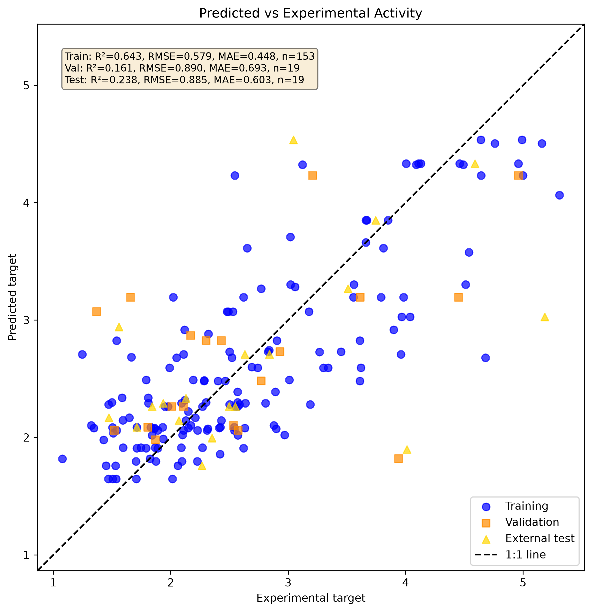
  - Williams: 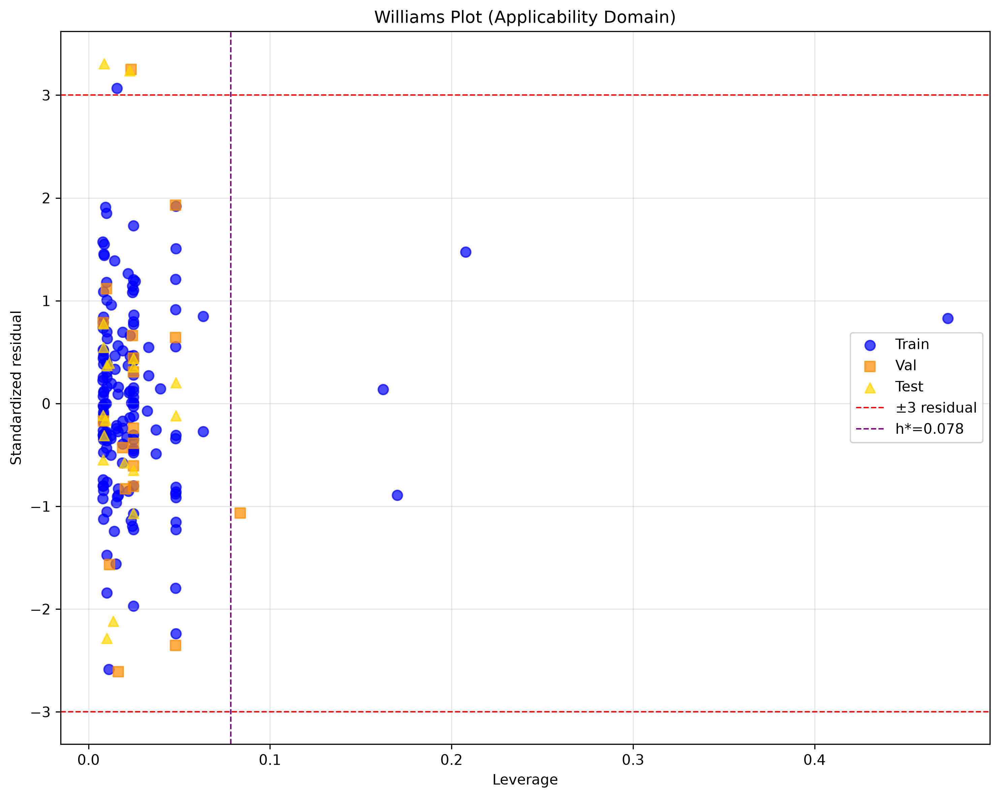
  - Residuals: 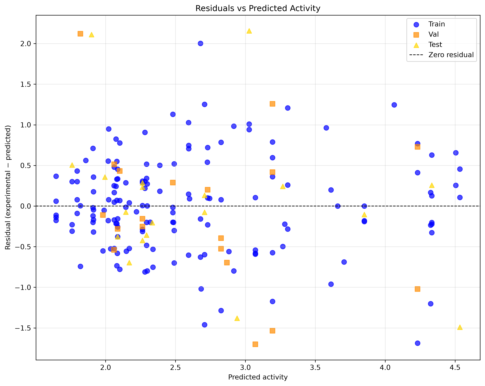
- CV predictions: `predictions/c6dc290a4a1b__k_neighbors_regressor__sfs_fixed_ga_plus2_cv_predictions.csv`
- Test predictions: `predictions/c6dc290a4a1b__k_neighbors_regressor__sfs_fixed_ga_plus2_test_predictions.csv`
- Config: `configs/c6dc290a4a1b__k_neighbors_regressor__sfs_fixed_ga_plus2_config.json`
- Pipeline: `models/c6dc290a4a1b__k_neighbors_regressor__sfs_fixed_ga_plus2_pipeline.joblib`
- AD method: `williams_leverage`
- Warning leverage: 0.078431
- Residual threshold: 3.000000
- Structural outlier IDs: ['compound_7', 'compound_129', 'compound_30', 'compound_184', 'compound_6']
- Response outlier IDs: ['compound_179', 'compound_186', 'compound_185', 'compound_64']
- AD handling: `informational_only` — Williams-plot applicability domain is a diagnostic report. Structural and response outliers were not excluded from training and were not used for model selection.

## Applicability domain

- Winner run: `c6dc290a4a1b__svr__sfs_fixed_ga_plus2`
- Method: `williams_leverage`
- Warning leverage h*: 0.176471
- Residual threshold: 3.000000
- Structural outliers (n=7): ['compound_133', 'compound_180', 'compound_36', 'compound_178', 'compound_141', 'compound_119', 'compound_182']
- Response outliers (n=2): ['compound_71', 'compound_167']
- Handling decision: `informational_only`
- Justification: Williams-plot applicability domain is a diagnostic report. Structural and response outliers were not excluded from training and were not used for model selection.
- Outliers by partition:
  - train: structural=['compound_133', 'compound_180', 'compound_36', 'compound_178', 'compound_141']; response=['compound_71', 'compound_167']
  - val: structural=['compound_119']; response=none
  - test: structural=['compound_182']; response=none

## Error analysis

- Winner run: `c6dc290a4a1b__svr__sfs_fixed_ga_plus2`
- Largest-error compounds:
  - `compound_71` (train): activity=4.643000, predicted=2.236214, |residual|=2.406786, AD=response_outlier
  - `compound_167` (train): activity=5.310000, predicted=3.552081, |residual|=1.757919, AD=response_outlier
  - `compound_131` (test): activity=2.130000, predicted=3.749298, |residual|=1.619298, AD=in_domain
  - `compound_179` (train): activity=4.680000, predicted=3.080856, |residual|=1.599144, AD=in_domain
  - `compound_181` (train): activity=3.960000, predicted=2.407520, |residual|=1.552480, AD=in_domain
  - `compound_186` (val): activity=3.940000, predicted=2.519171, |residual|=1.420829, AD=in_domain
  - `compound_184` (train): activity=4.540000, predicted=3.186144, |residual|=1.353856, AD=in_domain
  - `compound_42` (val): activity=4.452000, predicted=3.110438, |residual|=1.341562, AD=in_domain
  - `compound_137` (train): activity=1.470000, predicted=2.770832, |residual|=1.300832, AD=in_domain
  - `compound_185` (test): activity=4.010000, predicted=2.725246, |residual|=1.284754, AD=in_domain
- Target-range performance:
  - low: n=64, r2=-2.396882, rmse=0.436897, mae=0.320350
  - mid: n=63, r2=-2.687642, rmse=0.372947, mae=0.254415
  - high: n=64, r2=-0.187998, rmse=0.765795, mae=0.563667
- Inside domain: n=182, r2=0.708495, rmse=0.517310, mae=0.365461
- Outside domain: n=9, r2=0.283857, rmse=1.043834, mae=0.676803
- Residual mean: 0.086454
- Residual std: 0.548124
- Residual vs predicted correlation: 0.142892

## Deterministic workflow conclusion

- Best run: `c6dc290a4a1b__svr__sfs_fixed_ga_plus2`
- Winner model: `SVR`
- Selection criterion: Highest combined R² (equal-weight mean training CV R² and holdout validation R²) among acceptable models, with a one-standard-error rule and estimator-simplicity tie-break. External-test metrics were not used for model selection.
- Acceptance status: False
- Failed criteria: ['train_cv_gap']
- Winner CV r2: 0.534902
- Winner train: r2=0.733866, rmse=0.500210, mae=0.322909, n=153
- Winner validation: r2=0.486991, rmse=0.695564, mae=0.578039, n=19
- Completed searches:
  - `dataset_validation`: completed
  - `descriptor_calculation`: completed (backends=RDKit; 3D_descriptors=False)
  - `umap_split`: completed (method=sorted)
  - `descriptor_preprocessing`: completed
  - `sequential_feature_selection`: completed
  - `feature_count_selection`: completed
  - `genetic_algorithm`: completed
  - `baseline_cv_diagnostics`: completed
  - `overfitting_assessment`: completed
  - `hpo_round_1`: completed (Best CV R²=0.534)
  - `hpo_round_2`: completed (Best CV R²=0.534)
  - `hpo_round_3`: completed (Best CV R²=0.537)
  - `final_model_selection`: completed
  - `model_fallback`: completed (Tried 4 fallback model(s); winner: SVR (sfs_fixed_ga_plus2))
  - `final_model`: completed
  - `applicability_domain`: completed

## Agent constraints

### Permitted actions
- Explain the deterministic one-SE feature-count selection without changing it
- Propose hyperparameter grids within the allowed estimator parameter space
### Prohibited actions
- Override the selected feature count
- Invent metrics or training results
- Train models or execute the scientific pipeline
- Use the external test set for tuning, feature selection, or model selection
### Iteration budget
- max_hpo_rounds: 3
### Compute budget
- max_candidates_per_round: 120
- hpo_n_jobs: -1
- sfs_n_jobs: -1
- ga_n_jobs: -1
### Approval-required actions
- none
### Stopping conditions
- Model meets acceptance criteria (overfitting status good)
- CV improvement below min_cv_improvement
- Maximum HPO rounds reached
